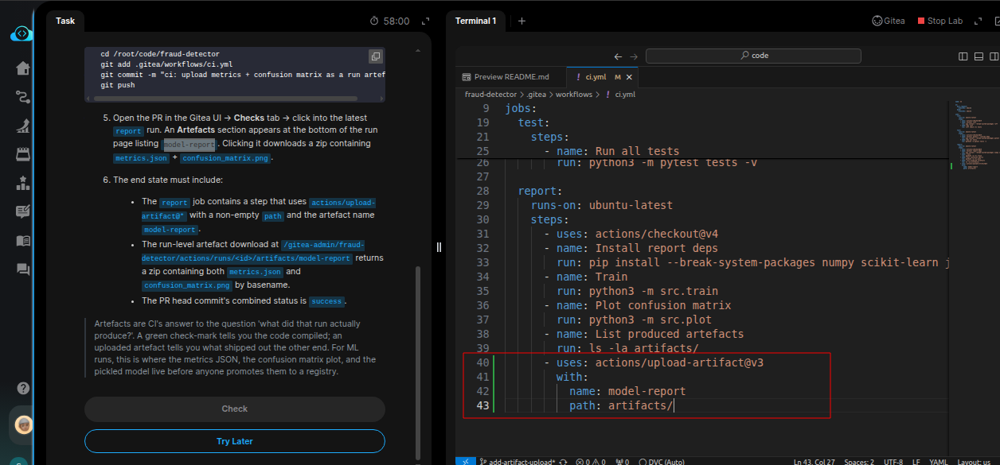
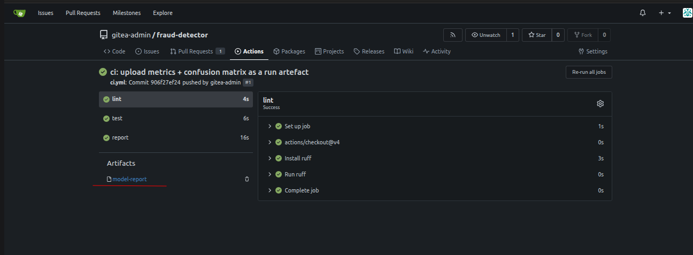

# Task: Generate Model Performance Reports in CI with CML

The xFusionCorp Industries ML platform team's CI already trains the model and renders a confusion-matrix PNG — but the artefacts are thrown away when the runner tears the workspace down, so reviewers on a PR never see them. A teammate has opened a PR titled Upload CML report as CI artefact on the `fraud-detector` repo. Your task is to wire `actions/upload-artifact` into the existing report job so the run's `metrics.json` and `confusion_matrix.png` land on the run page as a downloadable zip.


1. The Gitea UI is running on port `3000`. The Gitea button opens the login page. Admin credentials: `gitea-admin` / `gitea2026`. The repo lives at `http://localhost:3000/gitea-admin/fraud-detector` and a working clone is at `/root/code/fraud-detector,` already checked out on branch `add-artifact-upload.` The PR is pre-opened.

2. The current report job in `.gitea/workflows/ci.yml` already:

  - Installs numpy scikit-learn joblib matplotlib.
  - Runs python3 -m src.train (writes artifacts/model.joblib and artifacts/metrics.json).
  - Runs python3 -m src.plot (writes artifacts/confusion_matrix.png).
  - Ends with ls -la artifacts/ so you can see the files in the run log.

3. Modify `/root/code/fraud-detector/.gitea/workflows/ci.yml` so the report job has an additional final step that uses `actions/upload-artifact@v3` to upload the `artifacts/` directory as a named artefact (`model-report`).

4. Commit and push:

```
   cd /root/code/fraud-detector
   git add .gitea/workflows/ci.yml
   git commit -m "ci: upload metrics + confusion matrix as a run artefact"
   git push
```


5. Open the PR in the Gitea UI -> Checks tab -> click into the latest report run. An *Artefacts* section appears at the bottom of the run page listing `model-report.` Clicking it downloads a zip containing `metrics.json` + `confusion_matrix.png.`

6. The end state must include:

  - The report job contains a step that uses actions/upload-artifact@* with a non-empty path and the artefact name model-report.
  0 The run-level artefact download at /gitea-admin/fraud-detector/actions/runs/<id>/artifacts/model-report returns a zip containing both metrics.json and confusion_matrix.png by basename.
  0 The PR head commit's combined status is success.

> Artefacts are CI's answer to the question 'what did that run actually produce?'. A green check-mark tells you the code compiled; an uploaded artefact tells you what shipped out the other end. For ML runs, this is where the metrics JSON, the confusion matrix plot, and the pickled model live before anyone promotes them to a registry.

---
# Solution:

- This task asks to add a final step to the current `ci.yml` with `actions/upload-artifact@v3` in the `report` job, so that the reportes generated by the CI runs,
`metrics.json` ad `cofusion_matrix.png` are uploaded as CI artifacts and are avaibale on the run page in Gitea.

- Enter `fraud-detector` directory and inspect the `./.gitea/workflows/ci.yml` in VSCode. We need to add a final step in the `report` job with `actions/upload-artifact@v3` with appropriate name and path for artifacts to be stored:

> Refer to the [official docs](https://github.com/actions/upload-artifact) for all the options avaailable in the uploads-artifact acion. 
> Note that we need to use the `v3` of the updaload-artifacts in this lab, else we will get nodejs compatibility error on the CI runs



- Use the commands provided in the description to stage, commit and push the changes to remote:

```
   git add .gitea/workflows/ci.yml
   git commit -m "ci: upload metrics + confusion matrix as a run artefact"
   git push
```

- Open Gitea UI and login using the credentials provided and navigate to the **Actions** tab and click on the latest run with recent commit message.
You should see the action complted all the steps successfuly, and an artifact named `model-report` available.



Done! Hit **Check**
