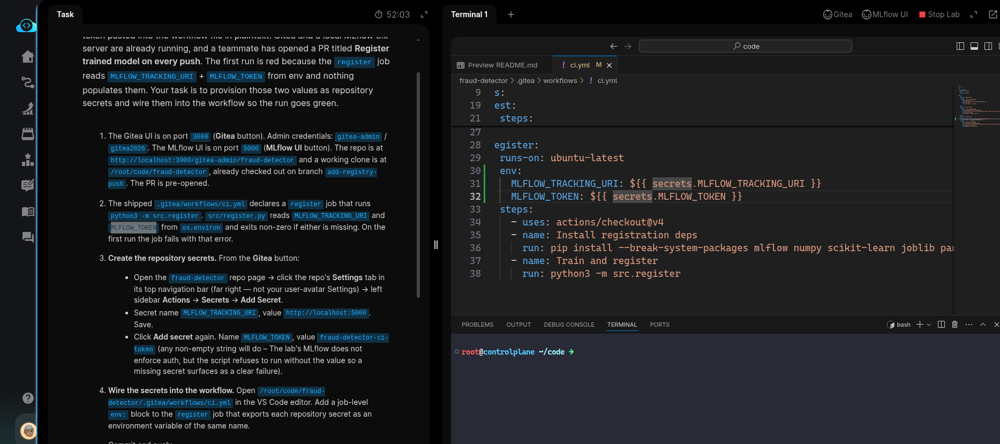
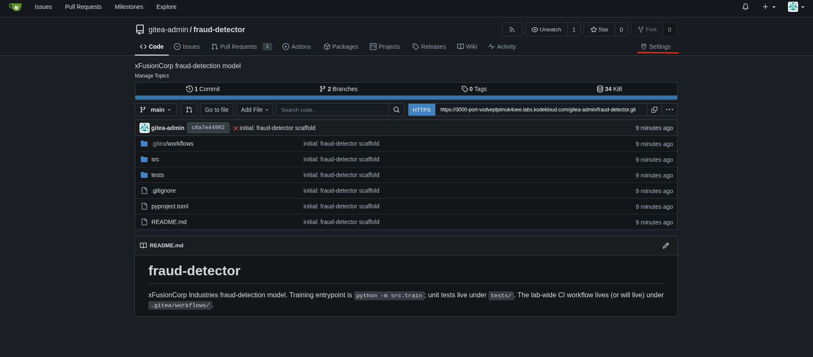
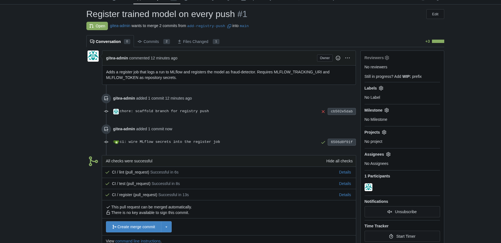
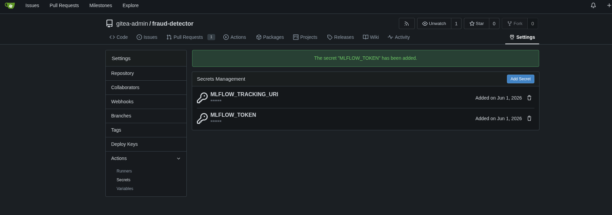
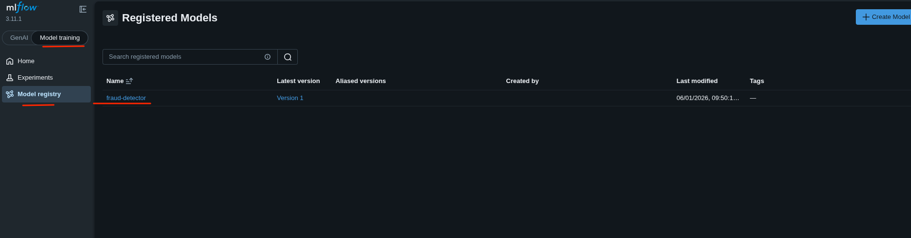

# Task: Automate Model Registration in CI/CD

The xFusionCorp Industries ML platform team wants every PR on the `fraud-detector` repo to log a training run to MLflow and register the resulting model version — but they do not want the tracking URL or an API token pasted into the workflow file in plaintext. Gitea and a local MLflow 3.x server are already running, and a teammate has opened a PR titled Register trained model on every push. The first run is red because the register job reads `MLFLOW_TRACKING_URI` + `MLFLOW_TOKEN` from env and nothing populates them. Your task is to provision those two values as repository secrets and wire them into the workflow so the run goes green.


1. The Gitea UI is on port `3000` (Gitea button). Admin credentials: `gitea-admin` / `gitea2026`. The MLflow UI is on port `5000` (MLflow UI button). The repo is at `http://localhost:3000/gitea-admin/fraud-detector` and a working clone is at `/root/code/fraud-detector`, already checked out on branch `add-registry-push.` The PR is pre-opened.

2. The shipped `.gitea/workflows/ci.yml` declares a `register` job that runs `python3 -m src.register`. `src/register.py` reads `MLFLOW_TRACKING_URI` and `MLFLOW_TOKEN` from `os.environ` and exits non-zero if either is missing. On the first run the job fails with that error.

3. Create the repository `secrets`. From the Gitea button:

  - Open the `fraud-detector` repo page -> click the repo's Settings tab in its top navigation bar (far right — not your user-avatar Settings) -> left sidebar Actions -> Secrets -> Add Secret.
  - Secret name `MLFLOW_TRACKING_URI`, value `http://localhost:5000`. Save.
  - Click Add secret again. Name `MLFLOW_TOKEN`, value `fraud-detector-ci-token` (any non-empty string will do – The lab's MLflow does not enforce auth, but the script refuses to run without the value so a missing secret surfaces as a clear failure).

4. Wire the secrets into the workflow. Open `/root/code/fraud-detector/.gitea/workflows/ci.yml` in the VS Code editor. Add a job-level `env:` block to the register job that exports each repository secret as an environment variable of the same name.

Commit and push:

```
   cd /root/code/fraud-detector
   git add .gitea/workflows/ci.yml
   git commit -m "ci: wire MLflow secrets into the register job"
   git push
```


5. Return to the PR's Checks tab. The new run finishes green, and the MLflow UI (port `5000`) shows `fraud-detector` under Models with one new version.

6. The end state must include:

  - GET /api/v1/repos/gitea-admin/fraud-detector/actions/secrets lists both MLFLOW_TRACKING_URI and MLFLOW_TOKEN.
  - The register job in the workflow references each secret via ${{ secrets.<NAME> }} inside an env: block (job-level or step-level).
  - The PR head commit's combined status is success.
  - MLflow's registered-model endpoint reports fraud-detector with at least one version.

> Repository secrets are the CI version of an environment-specific config file. The YAML stays identical between dev, staging, and prod; only the secret values change. This is also the pattern you extend when you add a PyPI token, an S3 access key, or a Kubernetes kubeconfig to a workflow—never paste the value into the committed file.

---

# Solution:

- This involes adding a `env:` blcok at the job level in the `./.gitea/workflows/ci.yml` and registering the secrets in Gitea as Actions Secrets.

- Open `./.gitea/workflows/ci.yml` and add an `env:` block in the `register` job:



- Add the *Repository Secrets* in the Gitea UI, login using the credentials provided. Click on the **Settings** on the `fraud-detector` repo:




- Add Secret name `MLFLOW_TRACKING_URI`, value `http://localhost:5000`. Save. Click Add secret again. Name `MLFLOW_TOKEN`, value
`fraud-detector-ci-token`.



- Verify if both the secres are added



- On the lab terminal stage, commit and push the changes to remote using the comands provided in the task description:

```
   cd /root/code/fraud-detector
   git add .gitea/workflows/ci.yml
   git commit -m "ci: wire MLflow secrets into the register job"
   git push
```


- On the Gitea UI, verify that all the CI checks pass from the PR page


- Verify that the **MLFlow** UI has a model registered by name `fraud-detector` with a version, in this case it's `version 1`.



Done!! Hit **Check**
