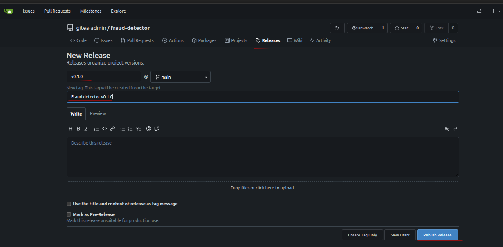
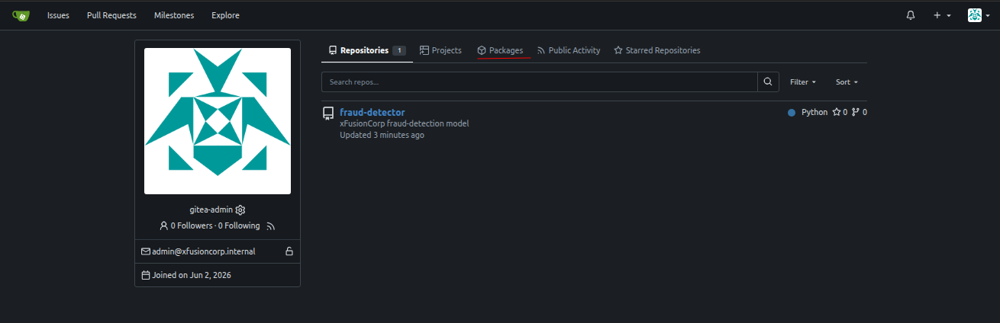

# Task: Automate Model Deployment with CD Pipeline

The xFusionCorp Industries ML platform team wants every `fraud-detector` release tag to be reproducible from a single Gitea page — the *Docker* image that runs in production, the `metrics.json` the model scored, and a permanent link to the commit that produced them. A release workflow is already committed to main at `.gitea/workflows/release.yml` and the repo's *Dockerfile* is in place. Your task is to publish the `v0.1.0` release from the Gitea UI so the tag-triggered workflow fires and fans out all three artefacts.

1. The Gitea UI is running on port `3000`. The Gitea button opens the login page. Admin credentials: `gitea-admin` / `gitea2026`. The repo is at `http://localhost:3000/gitea-admin/fraud-detector` and a working clone is at `/root/code/fraud-detector.`

2. The release workflow (`.gitea/workflows/release.yml`) triggers on any `v*` tag push. Its job:

  - Logs in to `localhost:3000` (Gitea's built-in container registry) using the pre-provisioned repository secret REGISTRY_TOKEN.
  - `docker build` + `docker push` the image as `localhost:3000/gitea-admin/fraud-detector:<tag>`.
  - Runs `python3 -m src.train` to emit `artifacts/metrics.json`.
  - Uploads `metrics.json` to the release via `akkuman/gitea-release-action@v1`.

3. From the Gitea button, open the fraud-detector repo and:

  - Click the Releases tab.
  - Click New Release (top right).
  - Tag name: v0.1.0.
  - Target: main.
  - Release title: Fraud detector v0.1.0 (any non-empty title).
  - Click Publish Release.

4. Publishing the release creates the tag, which triggers the workflow. Return to the repo's Actions tab to watch the run; when it finishes, refresh the Releases page to see `metrics.json` listed under Downloads, and open Packages (top-right profile menu or /{owner}/-/packages) to confirm that the container image landed.

5. The end state must include:

  - `GET /api/v1/repos/gitea-admin/fraud-detector/releases/tags/v0.1.0` returns a release whose tag_name is `v0.1.0`.
  - The tag's commit SHA reports combined status success on its checks.
  - The release's assets array contains an entry whose name resolves to `metrics.json.`
  - Gitea's packages API (`GET /api/v1/packages/gitea-admin?type=container`) lists a container package named fraud-detector with a version equal to `v0.1.0` (or 0.1.0).

> Tagging a release is the moment a commit becomes addressable by humans, not just by SHA. The workflow's job is to make sure the release carries
everything downstream systems need—an image reference for the deployer, a metrics file for compliance, a signed tag for provenance—so the Releases
page becomes the single source of truth for what's running in production.

---

# Solution:

- This tasks is about cutting a new tagged release from the Gitea UI, such that `metrics.json` and a container image are published.

- Login to the Gitea UI using the credentials provided, and navigate to the **Relases** page and fill in the form for a tagged release.

- Once the release is created a `build-and-publish` action will trigger, that will generate `metrics.json` and `fraud-detector:v0.1.0` Image. Verify
by navigating to the **ACtions** page.

![build-publisg-action]

- When the action competes successfuly, navigate to **REleases** page, and verify that the `metrics.json` is generated and available in the
*Downloads* box.

- Navigate to profile level *packages*, availabe from your profile page, and under **Packages** tab, you will find the container image listed.

The release is created and the required packages by the `build-and-push` action are generated. You can hit **Check** 
