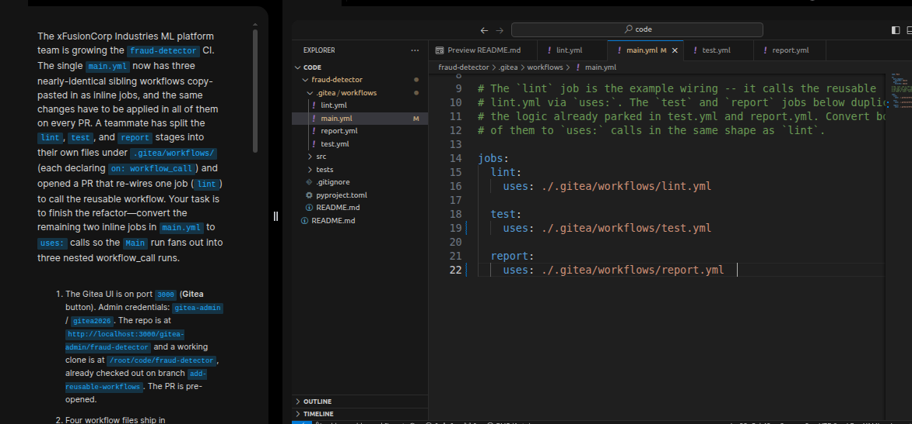
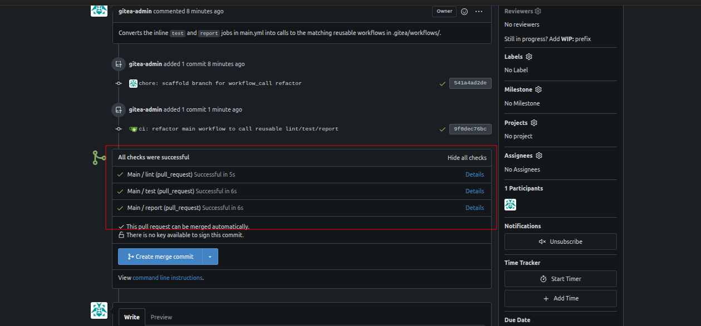

# Task: End-to-End ML CI/CD Pipeline

The xFusionCorp Industries ML platform team is growing the `fraud-detector` CI. The single `main.yml` now has three nearly-identical sibling workflows copy-pasted in as inline jobs, and the same changes have to be applied in all of them on every PR. A teammate has split the `lint`, `test`, and `report` stages into their own files under `.gitea/workflows/` (each declaring on: `workflow_call`) and opened a PR that re-wires one job (lint) to call the reusable workflow. Your task is to finish the refactor — convert the remaining two inline jobs in `main.yml` to `uses: calls` so the Main run fans out into three nested `workflow_call` runs.


1. The Gitea UI is on port `3000` (Gitea button). Admin credentials: `gitea-admin` / `gitea2026`. The repo is at `http://localhost:3000/gitea-admin/fraud-detector` and a working clone is at `/root/code/fraud-detector,` already checked out on branch `add-reusable-workflows` The PR is pre-opened.

2. Four workflow files ship in `.gitea/workflows/`:

  - `lint.yml`, `test.yml`, `report.yml` – Reusable callees, each triggered by on: `workflow_call`.
  - `main.yml` – The caller. It already has:
  - `jobs.lint` calling `./.gitea/workflows/lint.yml` via uses: (the example wiring).
  - `jobs.test` + `jobs.report` as inline `runs-on` + `steps` jobs that duplicate logic already parked in the callee files.

3. Edit `/root/code/fraud-detector/.gitea/workflows/main.yml.` Replace each inline test and report job body with a single uses: line that mirrors the existing lint job. A job cannot declare both `uses:` and `steps:`, so delete the inline `runs-on` + `steps` blocks entirely.

4. Commit and push:

```
   cd /root/code/fraud-detector
   git add .gitea/workflows/main.yml
   git commit -m "ci: refactor main workflow to call reusable lint/test/report"
   git push
```

Open the PR's Checks tab — the new run shows one top-level Main workflow with three nested callee workflows expanded beneath it. Each child is independently re- runnable and has its own log.

5. The end state must include:
  - `lint.yml`, `test.yml`, and `report.yml` each declare `on: workflow_call` on the PR head branch.
  - `main.yml` defines jobs `lint`, `test`, and `report`, each with a `uses:` key pointing at the matching `./.gitea/workflows/<name>.yml`.
  - No job in `main.yml` mixes `uses:` with `steps:` (illegal in Actions YAML).
  - The PR head commit's combined status reaches success.

> Reusable workflows turn a monolithic main.yml into a small graph of composable pieces. Each callee becomes the canonical definition for its concern (lint / test / report); any number of callers can consume it. When you later add a release.yml workflow for tagged pushes, it can reuse the same test.yml callee—no more copy-paste sync issues across files.

---
# Solution:

- This task requires to update the existing workflow actions by usingthe [reusable worksflows](https://docs.github.com/en/actions/how-tos/reuse-automations/reuse-workflows).

- Open all the `*yml` files in VSCode and inspect them. We can see that the `lint.yml` is already wired up with reusable workflow calls with
`on.workflow_call`, and `main.yml` refers it with `jobs.lint.uses` path. Our task is to wire up all the remaining workflows simlilarly in `main.yml`,
`report.yml`, and `test.yml`.

Remove all the `steps` and `uses` directives in the `main.yml` and it should only reference the other three workflow files. The `lint.yml`,
`test.yml`, and `report.yml` already uses `on:workflow_call:` directive.




- Stage, commit and push the changes to the remote using the commands provided in the description:

```
   cd /root/code/fraud-detector
   git add .gitea/workflows/main.yml
   git commit -m "ci: refactor main workflow to call reusable lint/test/report"
   git push
```


- Navigate to the **Pull requests** tab on the Gitea UI, and verify that all the CI checks pass with `Main / lint`, `Main / test`, and `Main /
report`.



Done!! Hit **Check**.

