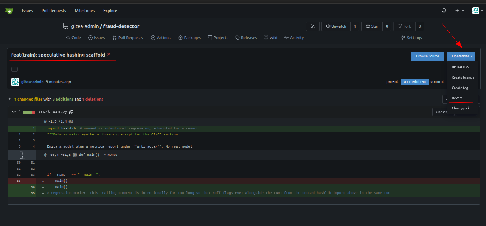
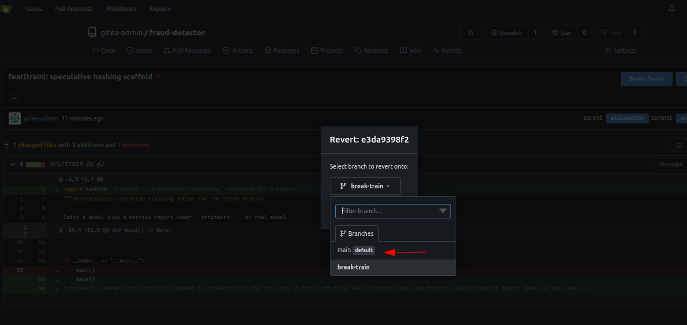
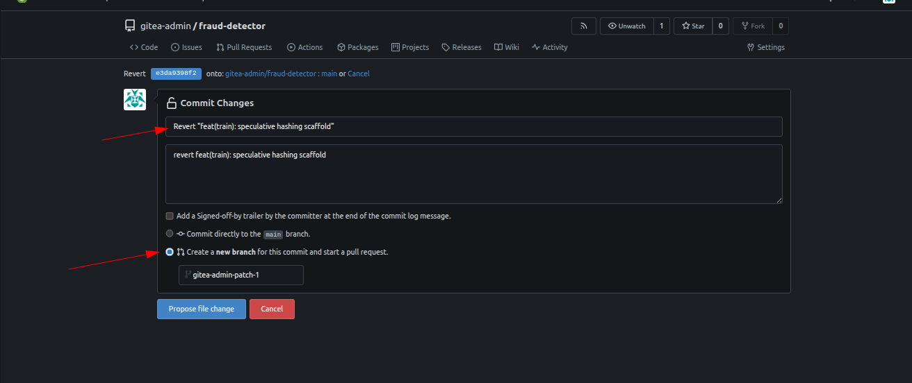
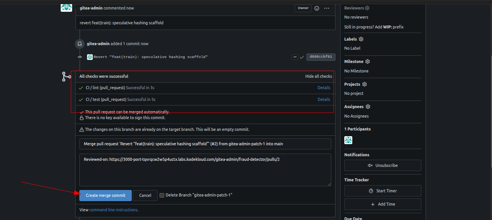
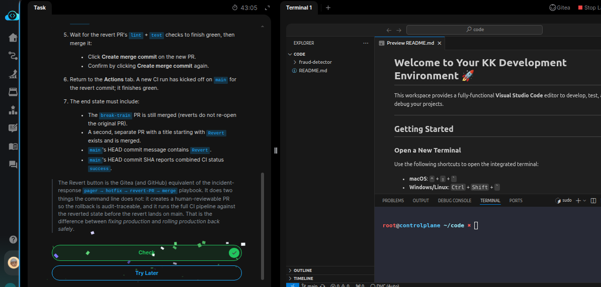

# Task: Automated Model Rollback with Health Checks

The xFusionCorp Industries ML platform team shipped a PR titled *Add speculative hashing scaffold* an hour ago — an admin merged it pre-review to unblock the Wednesday release cut. That change introduced a lint regression, and `main` has been red ever since. The team's rollback policy is explicit: no panic reverts from the command line, no force-pushes; the revert must go through a PR the same way the breakage did. Your task is to use Gitea's Revert button on the merged PR to roll the change off main and turn the CI green again.

1. The Gitea UI is on port `3000` (Gitea button). Admin credentials: `gitea-admin` / `gitea2026`. The repo is at `http://localhost:3000/gitea-admin/fraud-detector` and a working clone is at `/root/code/fraud-detector` (on `main`, which currently carries the regression). You do not need to run any git commands locally — the revert happens entirely in the Gitea UI.

2. Confirm the starting state. From the repo page:

  - Actions tab shows the latest CI run on main as red.
  - Pull Requests tab → switch to Closed → Add speculative hashing scaffold is listed as merged.

3. Open the merged PR and revert its commit:

  - Click the merged Add speculative hashing scaffold PR.
  - On the Conversation tab, click the short SHA of the commit that landed on main.
  - On the commit-detail page, open the Operations ▾ dropdown (top-right) and click Revert.
  - A popup asks Select branch to revert onto — pick main.
  - Gitea opens a full-page Commit Changes form. Edit the commit title so it starts with Revert (e.g. Revert "feat(train): speculative hashing scaffold"), select the radio Create a new branch for this commit and start a pull request (not Commit directly to the main branch), and click Propose file change (the bottom button — Gitea renames it from Commit Changes when the new-branch radio is active).

4. The form lands on a compare page showing the new branch vs `main`. Click New Pull Request, keep the prefilled title starting with Revert, and click Create Pull Request at the bottom.

5. Wait for the revert PR's `lint` + `test` checks to finish green, then merge it:

  - Click Create merge commit on the new PR.
  - Confirm by clicking Create merge commit again.

6. Return to the Actions tab. A new CI run has kicked off on `main` for the revert commit; it finishes green.

7. The end state must include:

  - The `break-train` PR is still merged (reverts do not re-open the original PR).
  - A second, separate PR with a title starting with Revert exists and is merged.
  - `main`'s HEAD commit message contains `Revert`.
  - `main`'s HEAD commit SHA reports combined CI status `success`.

> The Revert button is the Gitea (and GitHub) equivalent of the incident-response pager → hotfix → revert-PR → merge playbook. It does two things the command line does not: it creates a human-reviewable PR so the rollback is audit-traceable, and it runs the full CI pipeline against the reverted state before the revert lands on main. That is the difference between fixing production and rolling production back safely.

---
# Solution:

- The task is to use Gitea's Revert button on the merged PR to roll the change off main and turn the CI green again. We do not have to do any
operations on lab terminal, all the actions required are to be performed on Gitea UI.

- Login to Gitea UI using the credentials. Open the PR page and we can see that the CI Checks have failed. 
    - Click the merged Add speculative hashing scaffold PR.
    - On the **Conversation** tab, click the short SHA of the commit that landed on main.
    - On the commit-detail page, open the **Operations** ▾ dropdown (top-right) and click *Revert*.

- From the pop-up select the `main` branch from the dropdown

- Update the commit message and the select the radio with *Create a new branch for this commit and start a pull request*

- A new PR will be created with the prvided commit message. Visit the PR page and wait for the CI checks to pass and then merge the PR

Done!! Hit **Check**

