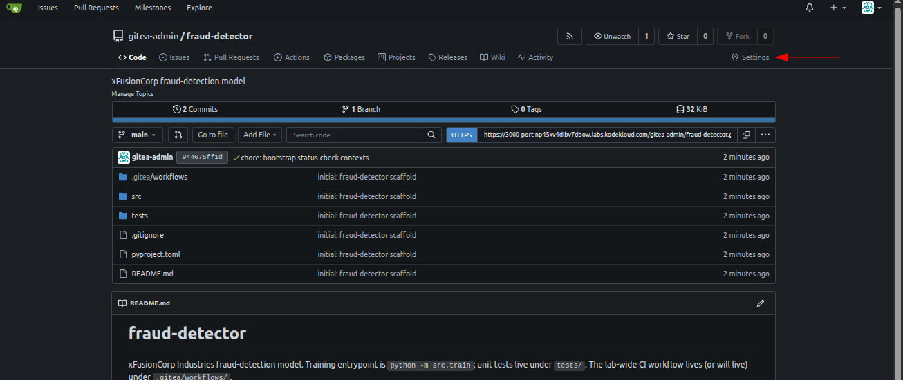
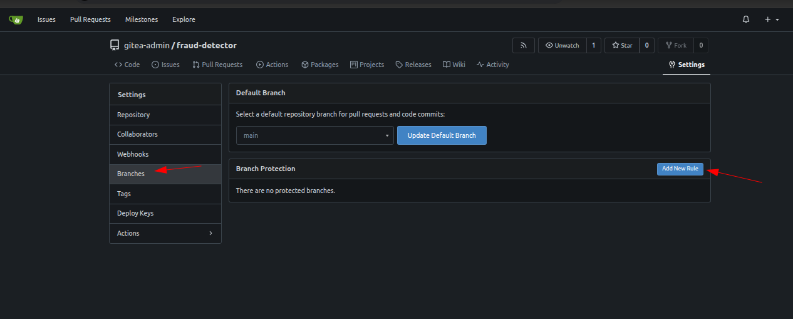
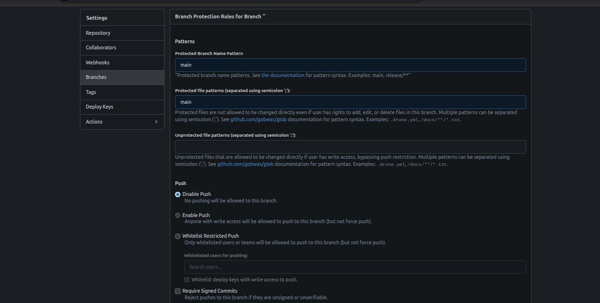
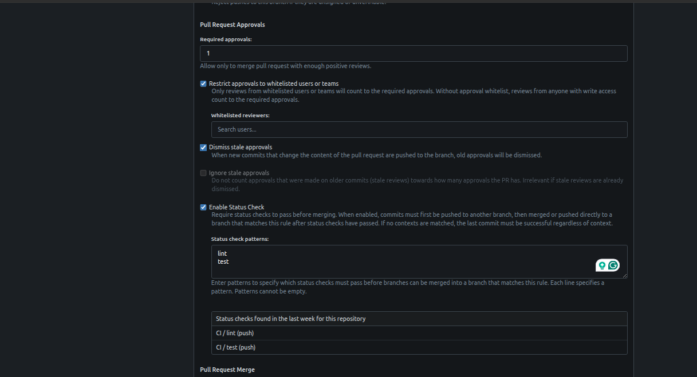
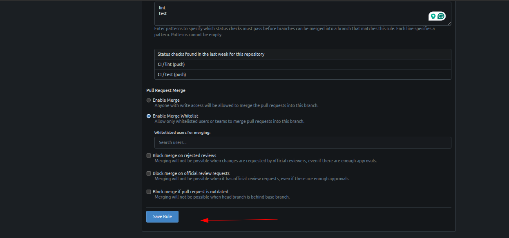
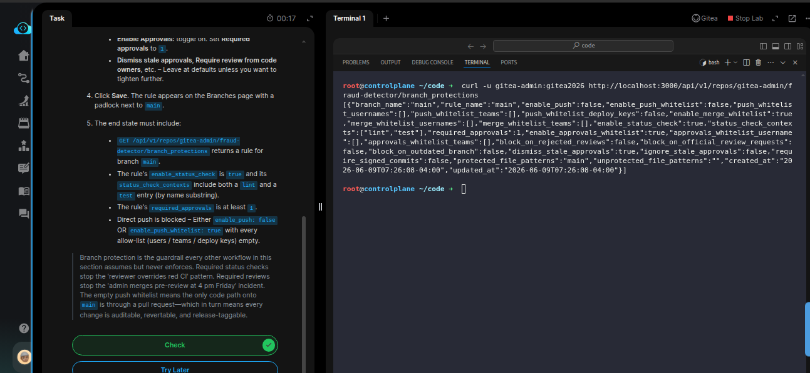

# Task:  Production ML CI/CD with Multi-Environment Promotion

The xFusionCorp Industries ML platform team is promoting the `fraud-detector` repo to production governance. A recent incident — where an admin force-merged a red PR and broke main for an hour—exposed the gap: `main` has a CI pipeline, but nothing forces contributors to wait for it before merging. Your capstone task is to close the gap. Configure Gitea branch protection on `main` so every future change must land through a pull request with green `lint` + `test` checks and at least one approving review.


1. The Gitea UI is on port `3000` (Gitea button). Admin credentials: `gitea-admin` / `gitea2026`. The repo is at `http://localhost:3000/gitea-admin/fraud-detector.` The CI workflow (with `lint` + `test` jobs) is live; a bootstrap run has already been triggered so Gitea knows the status-check context names.

2. From the Gitea button, open the `fraud-detector` repo and navigate to *Settings* (top right) -> *Branches* (left navigation). Click *Add Rule* (or edit the existing rule on main).

3. Configure the protection with the following settings:

  - Protected branch name pattern: `main`.
  - Enable Push Whitelist: toggle on, leave the user / `team` / deploy-key lists empty. This blocks every direct push to `main` – All changes must arrive through a pull request.
  - Enable Merge Whitelist: optional, defaults are fine.
  -Enable Status Check: toggle on. In the status-check contexts multi-select, tick the check names that correspond to the lint and test jobs.
  - Enable Approvals: toggle on. Set Required approvals to 1.
  - Dismiss stale approvals, Require review from code owners, etc. – Leave at defaults unless you want to tighten further.

4. Click Save. The rule appears on the Branches page with a padlock next to `main`.

5. The end state must include:

  - `GET /api/v1/repos/gitea-admin/fraud-detector/branch_protections` returns a rule for branch main.
  - The rule's `enable_status_check` is `true` and its `status_check_contexts` include both a `lint` and a `test` entry (by name substring).
  - The rule's `required_approvals` is at least 1.
  - Direct push is blocked – Either `enable_push:` false OR `enable_push_whitelist: true` with every `allow-list` (users / `teams` / deploy keys) empty.

> Branch protection is the guardrail every other workflow in this section assumes but never enforces. Required status checks stop the 'reviewer overrides red CI' pattern. Required reviews stop the 'admin merges pre-review at 4 pm Friday' incident. The empty push whitelist means the only code path onto main is through a pull request—which in turn means every change is auditable, revertable, and release-taggable.


---
# Solution:

- The is to configure Gitea branch protection on `main` so every future change must land through a pull request with green `lint` + `test` checks and at least one approving review.


- Open the Gitea UI and login using the credentials provided and navigate to *Settings* from the top righ of the `fraud=detector` repo and update the
  *Branch protection Rule* form:





- Fill the for as asked in the task description:

```
  - Protected branch name pattern: `main`.
  - Enable Push Whitelist: toggle on, leave the user / `team` / deploy-key lists empty. This blocks every direct push to `main` – All changes must arrive through a pull request.
  - Enable Merge Whitelist: optional, defaults are fine.
  -Enable Status Check: toggle on. In the status-check contexts multi-select, tick the check names that correspond to the lint and test jobs.
  - Enable Approvals: toggle on. Set Required approvals to 1.
  - Dismiss stale approvals, Require review from code owners, etc. – Leave at defaults unless you want to tighten further.
```








- Save thebnranch protection rule, and naviaget to lab terminal and query the `/branch_protection` endpoint for the `fraud-detector` repo. The
response should be a JSON body with the rule set for `fraud-detector` repo.



Verify, and Hit **Check**.

