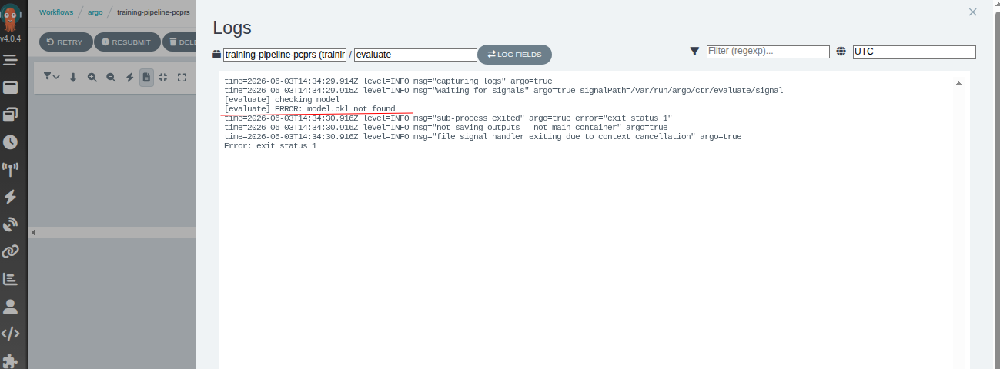
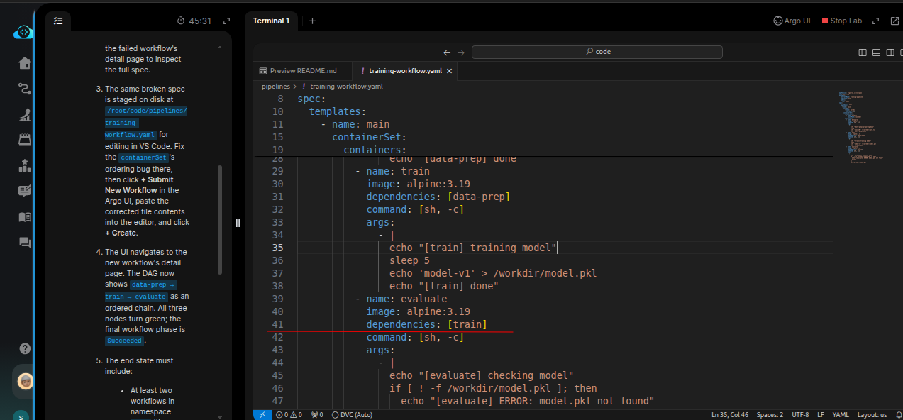
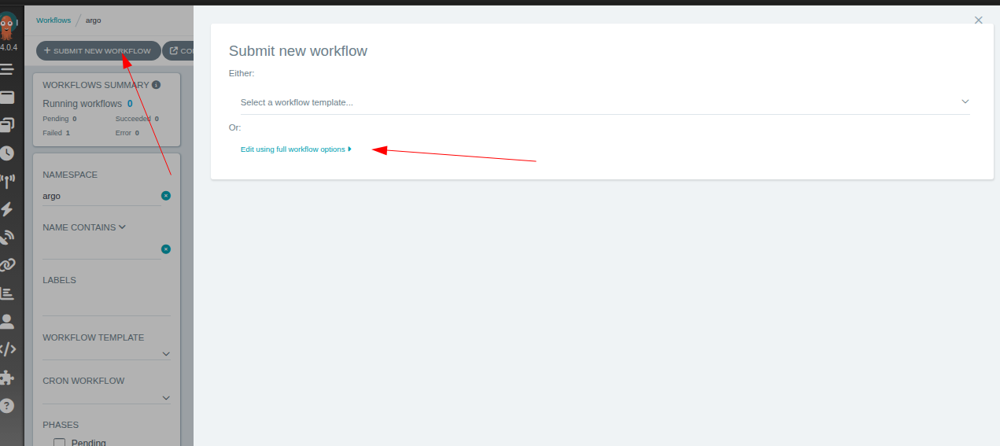
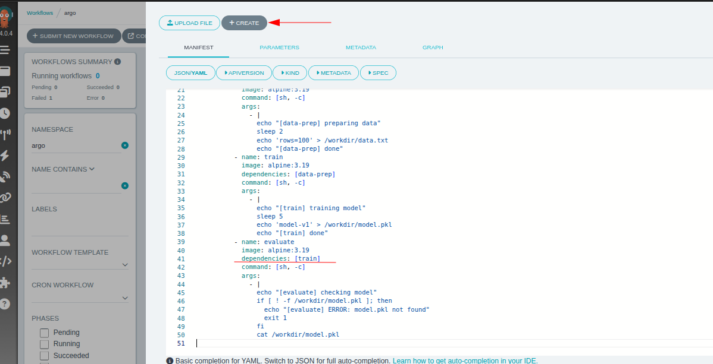
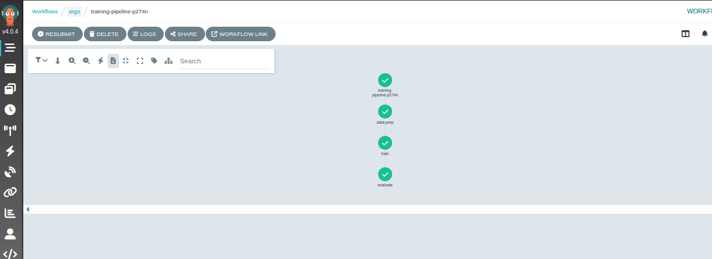

# Task: Create a Basic ML Training Workflow in Argo

The xFusionCorp Industries ML platform team submitted a first training workflow to Argo — three steps inside a `containerSet` sharing an `emptyDir:` `data-prep` → `train` → `evaluate`. It fires on every push, but the current run is red — one of the steps races its upstream. Your task is to read the broken DAG on the Argo UI, submit a corrected workflow through the UI's YAML editor, and watch the new run go green.

1. Click the Argo UI button at the top of the lab. The Workflows list shows the pre-submitted run (`training-pipeline-<suffix>`) in a Failed state. Click into it; the DAG view shows which step is red and why.

2. Click the YAML tab on the failed workflow's detail page to inspect the full spec.

3. The same broken spec is staged on disk at `/root/code/pipelines/training-workflow.yaml` for editing in VS Code. Fix the containerSet's ordering bug there, then click + Submit New Workflow in the Argo UI, paste the corrected file contents into the editor, and click + Create.

4. The UI navigates to the new workflow's detail page. The DAG now shows `data-prep` → `train` → `evaluate` as an ordered chain. All three nodes turn green; the final workflow phase is Succeeded.

5. The end state must include:

  - At least two workflows in namespace argo (the original broken run plus the fixed resubmit).
  - The corrected workflow runs the three containerSet steps in the documented order — data-prep then train then evaluate — rather than in parallel.
  - The most recent workflow's status.phase == Succeeded (tests wait up to 240 s).

> The `containerSet` pattern packs multiple containers into a single pod sharing an `emptyDir`. Without an explicit ordering contract between those containers, Argo schedules them all at once and relies on pod start order to serialise them — which is not ordering at all, and is exactly what makes the existing run race.

---

# Solution:

- This task involves fixing a failed Argo workflow, and run a new workflow with the fix and make the workflow complete with success status.

- Open the Argo UI and inspect the logs of failed workflow `training-pipeline-<suffix>`. We can see that the logs mention *model.pkl not found*. 

- Inspect the workflow YAML manifest on the lab terminal at `/root/code/pipelines/training-workflow.yaml`. We can confirm that the `volumeMounts` are
  configured correctly for `evaluate` step. There's one missing piece in the `evaluate` container. It does not have hard-depency on the `train` to
complete. As `train` depends on `data-prep`, and the DAG flow should be `data-prep` → `train` → `evaluate`.

Update the `evaluate` container with `dependencies` field:

- Copy the updated **Workflow** manifest, and naviagate to the Argo UI, and click *Submit New Workflow* in the Argo UI, paste the updated yaml contents into the editor, and click + *Create*.

- Wait for the workflow to run, once it completes successfully, hit **Check** on the lab terminal.

> **Note**: Once the workflow completes with success, hit **Check** on the lab terminal witin 240 seconds, else the status would be not available on
> the lab termninal and may result in failed task.

