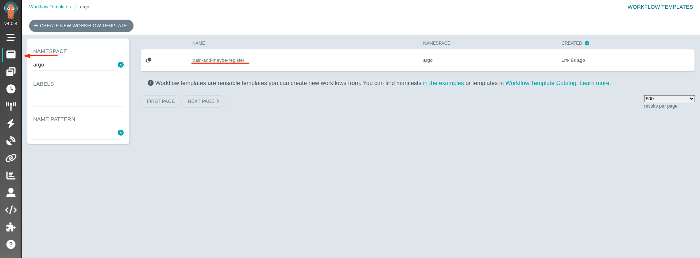
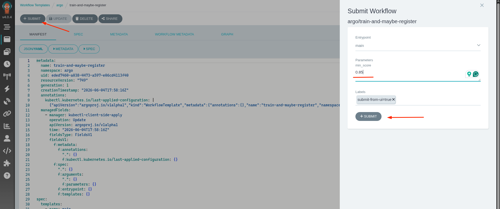
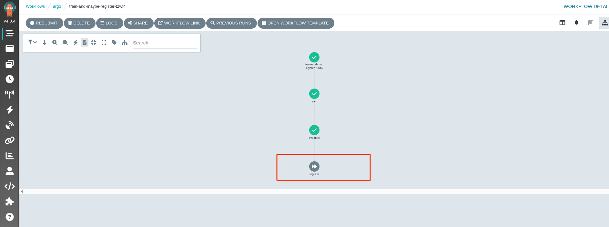
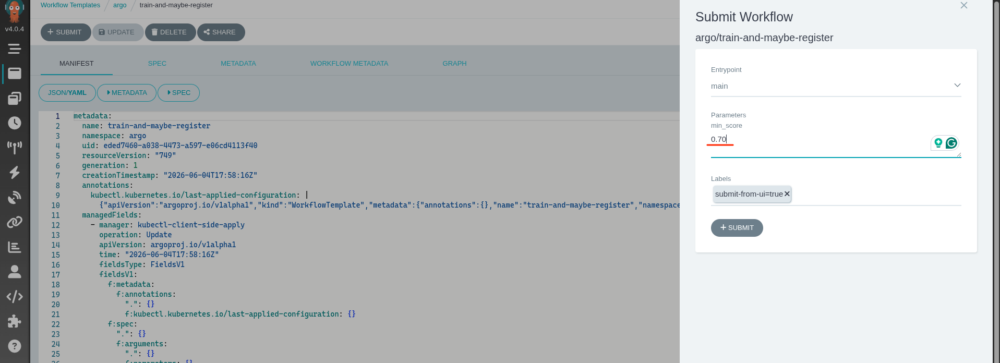
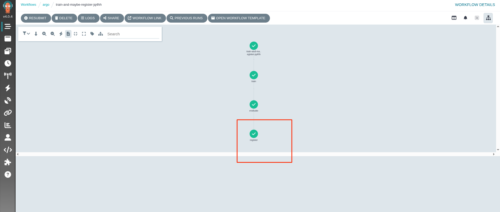
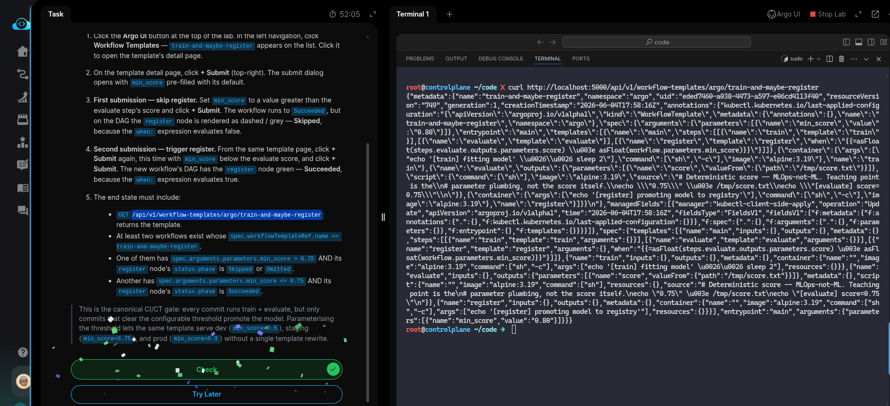

# Task: Pass Data Between Argo Steps with Output Parameters and Branching

The xFusionCorp Industries ML platform team wants a reusable training pipeline that only promotes a model to the registry when it clears a configurable quality gate — same `WorkflowTemplate`, different `min_score` per run. A `train-and-maybe-register` `WorkflowTemplate` is already applied in the `argo` namespace: it trains, evaluates (synthetic score 0.75), and conditionally runs a register step via `when: {{=asFloat(...score) > asFloat(...min_score)}}`. The `min_score` parameter defaults to `0.80` — so a default submission skips register. Your task is to submit the template twice from the Argo UI — once with a threshold that skips register, once with one that fires it — and confirm the difference on the DAG.

1. Click the Argo UI button at the top of the lab. In the left navigation, click Workflow Templates — `train-and-maybe-register` appears on the list. Click it to open the template's detail page.

2. On the template detail page, click + Submit (top-right). The submit dialog opens with `min_score` pre-filled with its default.

3. First submission — skip register. Set `min_score` to a value greater than the evaluate step's score and click + Submit. The workflow runs to Succeeded, but on the DAG the register node is rendered as dashed / grey — Skipped, because the `when:` expression evaluates false.

4. Second submission — trigger register. From the same template page, click + Submit again, this time with `min_score` below the evaluate score, and click + Submit. The new workflow's DAG has the register node green — Succeeded, because the `when:` expression evaluates true.

5. The end state must include:

  - `GET /api/v1/workflow-templates/argo/train-and-maybe-register` returns the template.
  - At least two workflows exist whose `spec.workflowTemplateRef.name == train-and-maybe-register`.
  - One of them has `spec.arguments.parameters.min_score > 0.75` AND its register node's `status.phase is Skipped or Omitted`.
  - Another has `spec.arguments.parameters.min_score <= 0.75` AND its register node's `status.phase is Succeeded`.

> This is the canonical CI/CT gate: every commit runs train + evaluate, but only commits that clear the configurable threshold promote the model. Parameterising the threshold lets the same template serve dev (min_score=0.5), staging (min_score=0.75), and prod (min_score=0.9) without a single template rewrite.

---

# Solution:

- This involes invoking the Argo template twice with different `min_score` values, and vusalize the behavior. If the `score` is greater than the `min_score`, the register node fires and the model is registered. Otherwise, the register node is skipped.

- Open the ArgoUI, and open *templates* from the left *Ribbon menu*, and open the existing template named `train-and-maybe-register`.

- First we will invoke the the template with default value of `0.85`, and that should skip the `register` step.

- Verify that the register node is marked as *skipped*.

- Next, we will re-submit the template with `min_score` value less than `0.75`. Set it to `0.70`. This should trigger the `register` node and
registerthe model.

- Verify that this run registers the model and runs successfuly.

- `curl` the workflow template endpoint from the lab terminal, and we should get a response with template in JSON.

Done!! Hit **Check**.
