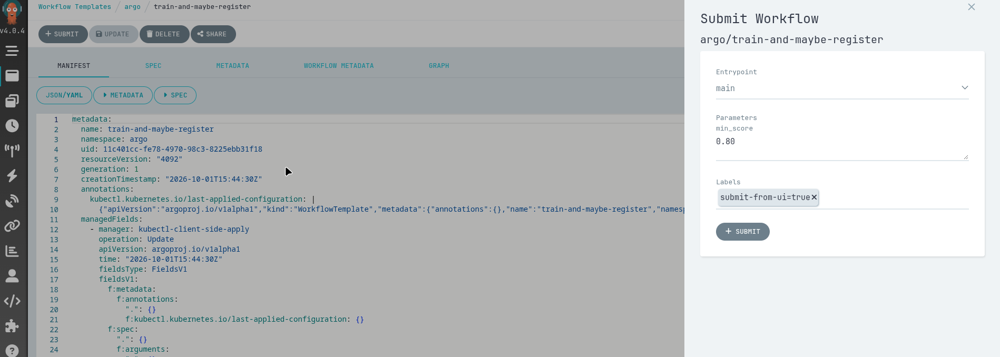
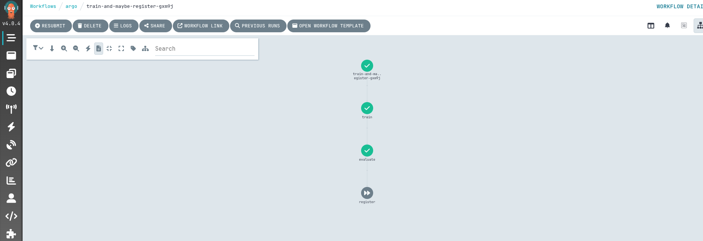
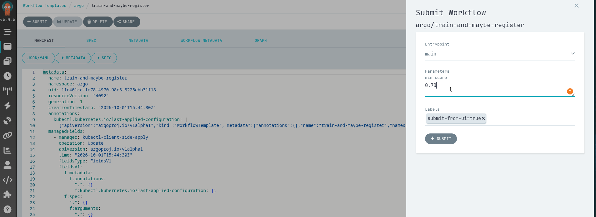
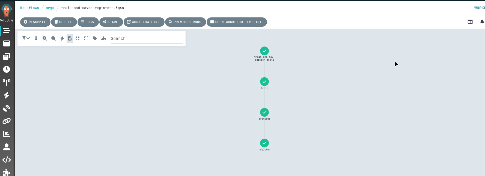

# Task: Pass Data Between Argo Steps with Output Parameters and Branching

The xFusionCorp Industries ML platform team requires a reusable training pipeline that promotes a model to the registry only when it passes a configurable quality gate. This pipeline should utilize the same WorkflowTemplate with differing min_score values for each run. Currently, a train-and-maybe-register WorkflowTemplate is available on disk; however, it is not yet functional. The evaluate step computes a synthetic score of 0.75 but does not publish it, and the register step lacks a quality gate, causing it to execute unconditionally. Your task is to complete the template by publishing the score as an output parameter and implementing a when: expression to gate the register step, ensuring that it compares the score to min_score. Once you have applied these changes, submit the workflow twice from the Argo UI to demonstrate the functionality of the gate: first with a threshold that prevents register from executing, and then with a threshold that allows it to execute.


The scaffolded template is at /root/code/argo/train-and-maybe-register.yaml. It is NOT applied yet — the Argo UI's Workflow Templates list (port 5000) stays empty until the template is applied to the argo namespace as a cluster resource.

Two TODO-marked pieces are missing from the YAML:

TODO 1 — evaluate template: the script writes a synthetic score to /tmp/score.txt, but the template does not yet expose that value to the rest of the workflow as an output parameter.
TODO 2 — register step in main: the register step currently runs unconditionally, rather than only when the score clears the min_score threshold.
With the template applied and appearing in the UI, submitting it twice demonstrates the gate: a run with min_score above the evaluate score (e.g. 0.99) reaches Succeeded with the register node Skipped (the when: evaluated false), while a run with min_score below the score (e.g. 0.5) has register Succeeded.

The end state must include:

GET /api/v1/workflow-templates/argo/train-and-maybe-register returns the template, whose evaluate template emits a score output parameter and whose register step carries a when: gate referencing both the evaluate score and min_score.
At least two workflows exist whose spec.workflowTemplateRef.name == train-and-maybe-register.
One with min_score > 0.75 has its register node Skipped/Omitted; another with min_score <= 0.75 has register Succeeded.
This is the canonical CI/CT gate: every commit runs train + evaluate, but only commits that clear the configurable threshold promote the model. Passing the score between steps as an output parameter—and gating promotion with when:—is what lets one template serve dev (min_score=0.5), staging (0.75), and prod (0.9) without a single rewrite.

---

# Solution:

Update the workflow template at `/root/code/argo/train-and-maybe-register.yaml` by completing the TODOs asked:

```yaml
apiVersion: argoproj.io/v1alpha1
kind: WorkflowTemplate
metadata:
  name: train-and-maybe-register
  namespace: argo
spec:
  entrypoint: main
  arguments:
    parameters:
      - name: min_score
        value: "0.80"
  templates:
    - name: main
      steps:
        - - name: train
            template: train
        - - name: evaluate
            template: evaluate
        - - name: register
            template: register
            when: "{{=asFloat(steps.evaluate.outputs.parameters.score) >= asFloat(workflow.parameters.min_score)}}"
    - name: train
      container:
        image: alpine:3.19
        command: [sh, -c]
        args: ["echo '[train] fitting model' && sleep 2"]
    - name: evaluate
      script:
        image: alpine:3.19
        command: [sh]
        source: |
          # Deterministic score -- MLOps-not-ML. Teaching point is the
          # parameter plumbing, not the score itself.
          echo "0.75" > /tmp/score.txt
          echo "[evaluate] score=0.75"
      outputs:
        parameters:
        - name: score
          valueFrom:
             path: /tmp/score.txt
    - name: register
      container:
        image: alpine:3.19
        command: [sh, -c]
        args: ["echo '[register] promoting model to registry'"]

```


- Apply the template:

```
kubectl apply -f /root/code/argo/train-and-maybe-register.yaml
```

- Now, on the Argo UI, in the Template tab select the `train-and-maybe-register` workflow, and Submit the workflow with defaul `min_score` value
  of `0.80`. The register step should fail.






- Now, resubmit the workflow with `min_score` set to less than `0.75`, and it should succeed in register step.






