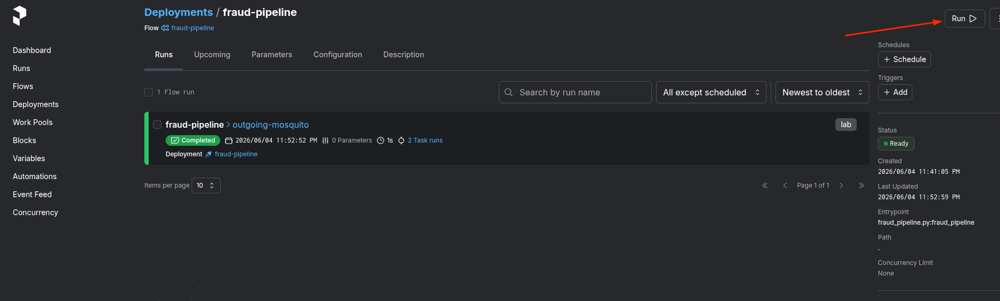
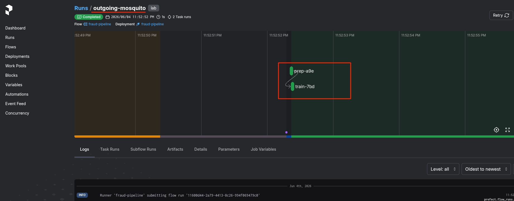
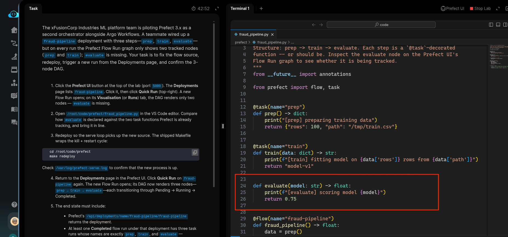
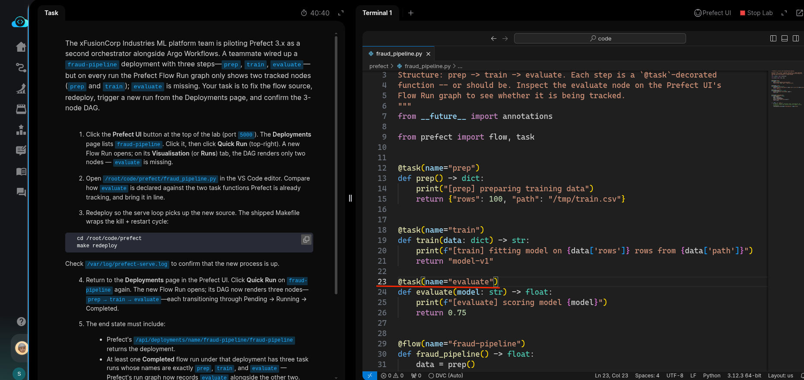
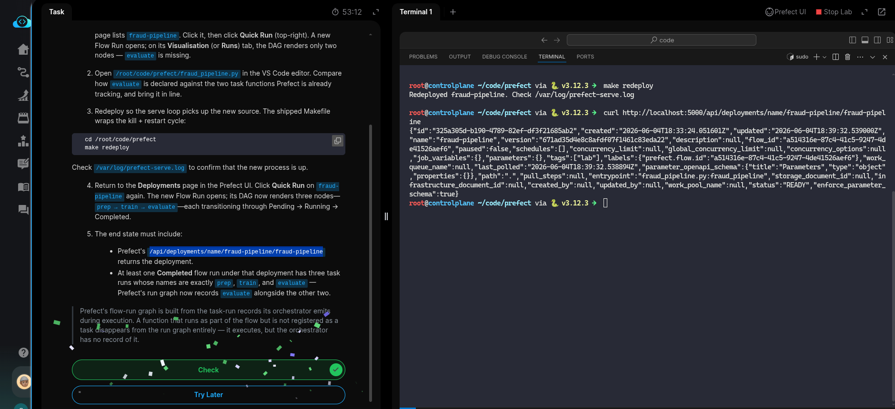

# Task: Create an ML Pipeline with Prefect


The xFusionCorp Industries ML platform team is piloting Prefect 3.x as a second orchestrator alongside Argo Workflows. A teammate wired up a `fraud-pipeline` deployment with three steps — `prep`, `train`, `evaluate` — but on every run the Prefect Flow Run graph only shows two tracked nodes (`prep` and `train`); `evaluate` is missing. Your task is to fix the flow source, redeploy, trigger a new run from the Deployments page, and confirm the 3-node DAG.


1. Click the Prefect UI button at the top of the lab (port `5000`). The Deployments page lists `fraud-pipeline`. Click it, then click Quick Run (top-right). A new Flow Run opens; on its Visualisation (or Runs) tab, the DAG renders only two nodes — evaluate is missing.

2. Open `/root/code/prefect/fraud_pipeline.py` in the VS Code editor. Compare how `evaluate` is declared against the two task functions Prefect is already tracking, and bring it in line.

3. Redeploy so the serve loop picks up the new source. The shipped Makefile wraps the kill + restart cycle:

```
   cd /root/code/prefect
   make redeploy
```

Check `/var/log/prefect-serve.log` to confirm that the new process is up.

4. Return to the Deployments page in the Prefect UI. Click Quick Run on `fraud-pipeline` again. The new Flow Run opens; its DAG now renders three nodes — `prep` → `train` → `evaluate` — each transitioning through *Pending* → *Running* → *Completed*.

4. The end state must include:

  - Prefect's `/api/deployments/name/fraud-pipeline/fraud-pipeline` returns the deployment.
  - At least one Completed flow run under that deployment has three task runs whose names are exactly prep, train, and evaluate — Prefect's run graph now records evaluate alongside the other two.

> Prefect's flow-run graph is built from the task-run records its orchestrator emits during execution. A function that runs as part of the flow but is not registered as a task disappears from the run graph entirely — it executes, but the orchestrator has no record of it.


---

# Solution:

- This task involes fixing the [Prefect](https://github.com/PrefectHQ/prefect) task function `evaluate` such that it's tracked and records alongside other two nodes, and it should be be avilable in the Prefect's run graph.

- Naidate to Perfect UI to visualize the current state of the graph. From the left menu click *Deployment*  -> `fraud-pipeline` -> **Run** dropdown
select *Quick run*.



- Now click on the *run name*, and it should open the graph shouing only two runs `prep` and `train`. We need to fix this such that `evaluate` is also
  recorded and available in the graph.



- Open the `/root/code/prefect/fraud_pipeline.py` in the VSCode and inspect. We can see that the `evaluate()` function does not contain a `task`
decorator. We add the decorator and fix it.





- Enter the `/root/code/prefect` directory, and run `make redploy`, and check for run in the Prefect UI. The run graph should show all the three nodes recorded.


- On the lab termonal query the `deployments` endpoint for the `fraud-pipeline`, and it should the JSON of the deployment as response. 

Done!! Hit **Check**


