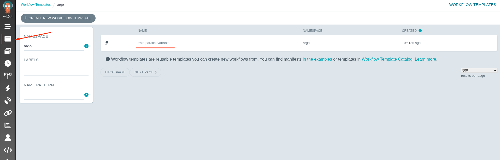
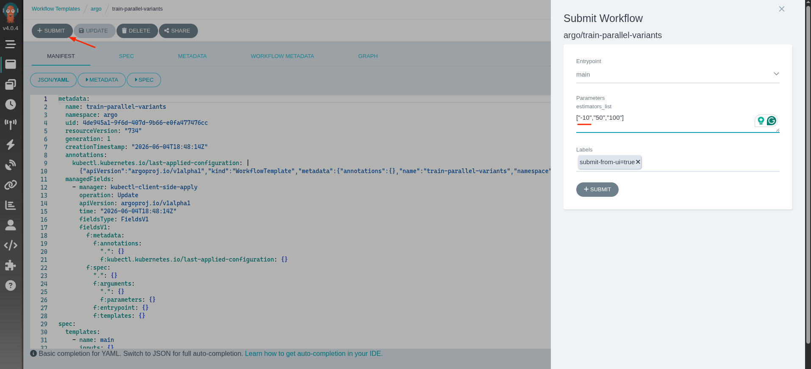
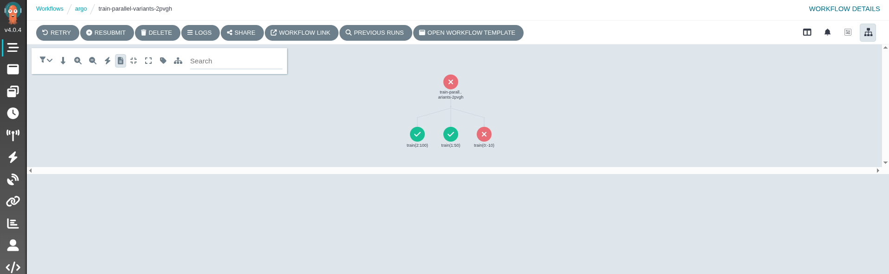
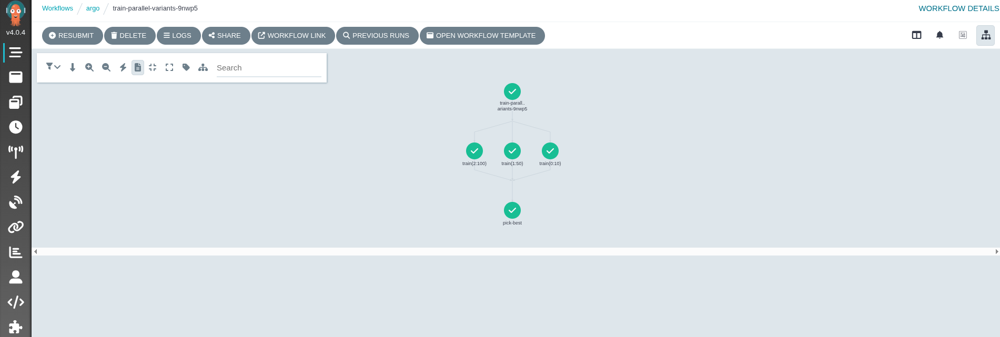
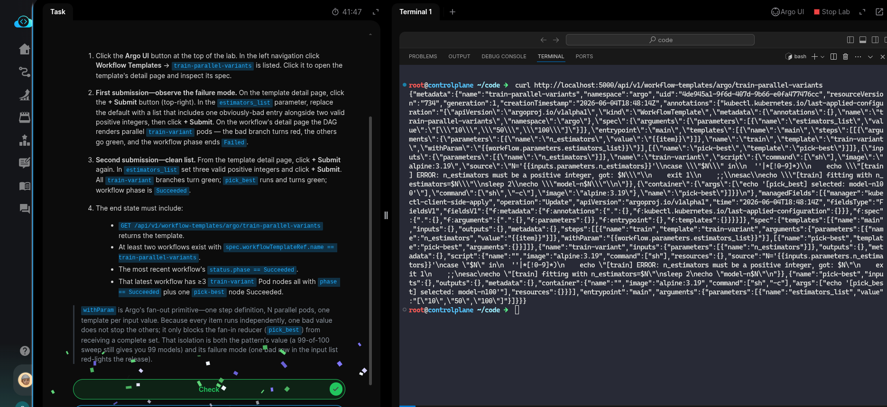

# Task: Parallel Model Training with Argo withItems Fan-Out

The xFusionCorp Industries ML platform team wants to train several model variants in parallel and pick the best one — fan-out over a hyperparameter list, fan-in to a reducer. A `train-parallel-variants` *WorkflowTemplate* is already applied in the argo namespace: it uses Argo's `withParam` against a JSON list of integer `n_estimators` values. Each train-variant validates its input and exits 1 on anything that is not a positive integer. Your task is to submit the template twice through the Argo UI - first with a deliberately bad entry (one branch will fail), then with a clean list (fan-out + reducer all green).

1. Click the Argo UI button at the top of the lab. In the left navigation click Workflow Templates → train-parallel-variants is listed. Click it to open the template's detail page and inspect its spec.

2. First submission — observe the *failure* mode. On the template detail page, click the + Submit button (top-right). In the `estimators_list` parameter, replace the default with a list that includes one obviously-bad entry alongside two valid positive integers, then click + Submit. On the workflow's detail page the DAG renders parallel `train-variant` pods — the bad branch turns red, the others go green, and the workflow phase ends *Failed*.

3. Second submission — clean list. From the template detail page, click + Submit again. In `estimators_list` set three valid positive integers and click + Submit. All train-variant branches turn green; `pick_best` runs and turns green; workflow phase is *Succeeded*.

4. The end state must include:

  - `GET /api/v1/workflow-templates/argo/train-parallel-variants` returns the template.
  - At least two workflows exist with `spec.workflowTemplateRef.name` == `train-parallel-variants.`
  - The most recent workflow's `status.phase` == *Succeeded*.
  - That latest workflow has ≥3 train-variant Pod nodes all with `phase` == `Succeeded` plus one pick-best node Succeeded.

> `withParam` is Argo's fan-out primitive—one step definition, N parallel pods, one template per input value. Because every item runs independently, one bad value does not stop the others; it only blocks the fan-in reducer (pick_best) from receiving a complete set. That isolation is both the pattern's value (a 99-of-100 sweep still gives you 99 models) and its failure mode (one bad row in the input list red-lights the release).

---

# Solution:

> **Fan-out** is a premitive where we split a single element into multiels. And, in Argo Workflow `withParams` is one we can leverege to execute a
fan-out or a fan-in where we aggregate (*reduce*) multiple elements into one.

- We need to try out two different workflow runs. One that fails because of one bad value of `n_estimators`, and the second, which succeeds due to all
  valid positive integers passed to `n_estimators`.

- Open Argo UI, and navigate to the `train-parallel-variants` template, and submitt the template with one bad value of `n_estimators` parameter: **(-10)** in our case:

We should observer the run with bad `n_estimators` value will fail, and others succeed.

- Now resubmit the template workflow with all valid parameters for `n_estimators`: **(10)**, a positive integer, and we should see all the three runs
  succeed, and even the `pick_best` pod show success.

- We can see that all the three pods for each `n_estimators` parameter succeed, and the `pick_best` also runs to sucess.

- On the lab terminal, query the `workflow-template` endpoint for `train-parallel-variants`, and we should get tyhe template in response with
templatein JSON.

Done!! Hit **Check**.

