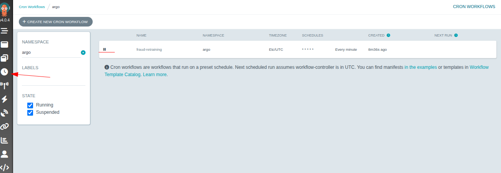
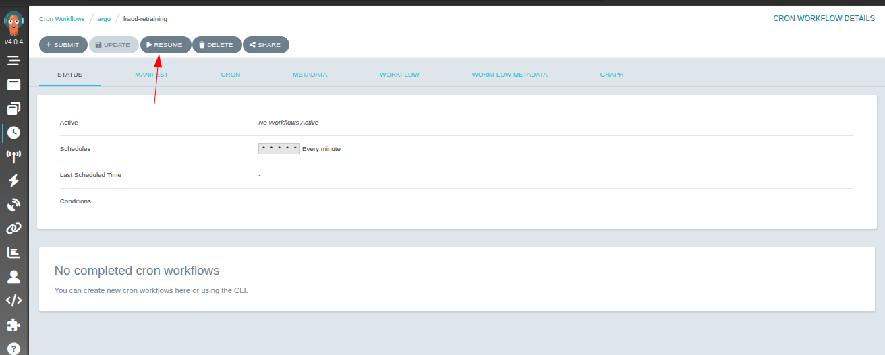
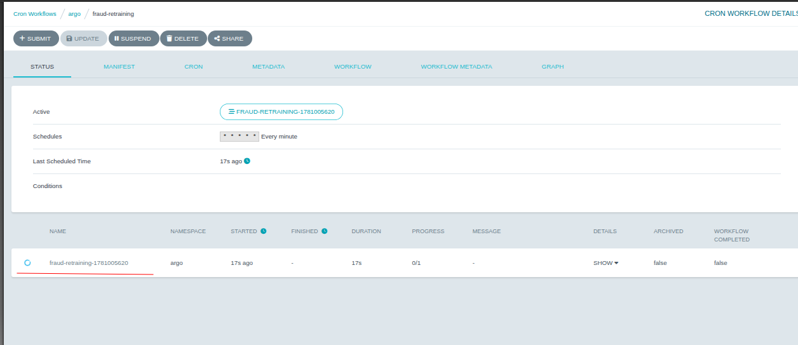
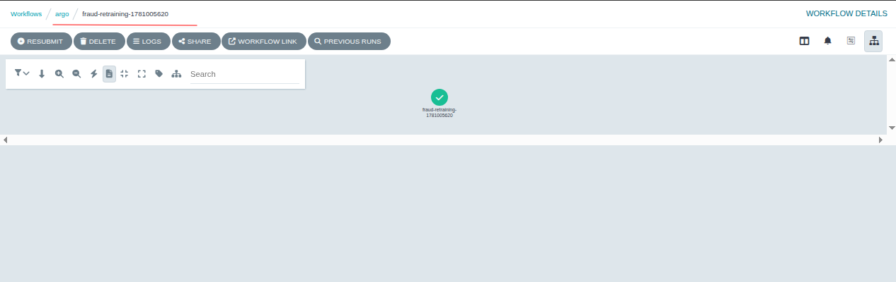
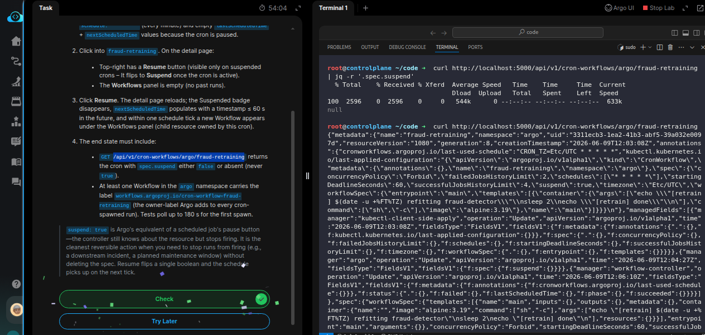

# Task: Automated Retraining with Argo CronWorkflow

The xFusionCorp Industries ML platform team has had a `fraud-retraining` *CronWorkflow* in argo for months. A teammate suspended it three days ago while debugging an unrelated issue and forgot to resume it. Nothing has retrained since. Your task is to find the cron on the Argo UI's *CronWorkflows* page and click Resume so the schedule fires again.

1. Click the Argo UI button at the top of the lab. In the left navigation click *Cron Workflows—fraud-retraining* is listed with a `Suspended` badge next to its name. The detail row shows `schedule: * * * * *` (every minute) and empty `lastScheduledTime` + `nextScheduledTime` values because the cron is paused.

2. Click into `fraud-retraining`. On the detail page:

  - Top-right has a *Resume* button (visible only on suspended crons – It flips to Suspend once the cron is active).
  - The Workflows panel is empty (no past runs).

3. Click *Resume*. The detail page reloads; the *Suspended* badge disappears, `nextScheduledTime` populates with a timestamp ≤ 60 s in the future, and within one schedule tick a new Workflow appears under the Workflows panel (child resource owned by this cron).

4. The end state must include:

  - `GET /api/v1/cron-workflows/argo/fraud-retraining` returns the cron with `spec.suspend` either `false` or absent (never `true`).
  - At least one Workflow in the `argo` namespace carries the label `workflows.argoproj.io/cron-workflow=fraud-retraining` (the owner-label Argo adds to every cron-spawned run). Tests poll up to 180 s for the first spawn.

> `suspend: true` is Argo's equivalent of a scheduled job's pause button — the controller still knows about the resource but stops firing. It is the cleanest reversible action when you need to stop runs from firing (e.g., a downstream incident, a planned maintenance window) without deleting the `spec.` Resume flips a single boolean and the schedule picks up on the next tick.

--- 

# Solution:

- This task focuses on automated model retraining using an Argo CronWorkflow. The fraud-retraining CronWorkflow is already configured to run every minute and trigger retraining jobs, but it has been suspended, preventing any new workflow executions from being scheduled. Our objective is to resume the CronWorkflow from the Argo UI, which clears the spec.suspend flag and allows the Argo controller to start scheduling runs again. Once resumed, the CronWorkflow should generate a new Workflow execution on the next schedule tick, restoring the automated retraining process.

- Open the ArgoCD UI, no credentials are required for login. Inspect the status of the *CronWorkflow* named `fraud-retraining`. We can see that it's
currently in suspended state.

- Expand the `fraud-retraining` CronWorkflow and click on *Resume*, so the the workflow restarts at the next scheduled interval.

- Once the CronWorkflow completes for one iteration, verify that the Workflow succeeded. We can expand the Pod and inspect the completed workflow.

- On the lab terminal we can query the `fraud-retraining` cron-workflow endpoint and verify that it returns a cron with `spec.suspended` is `null` in the
  JSON body.

Done!! Hit **Check**
