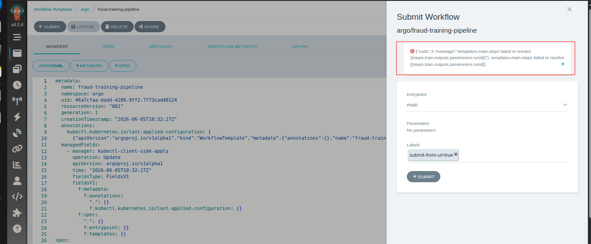
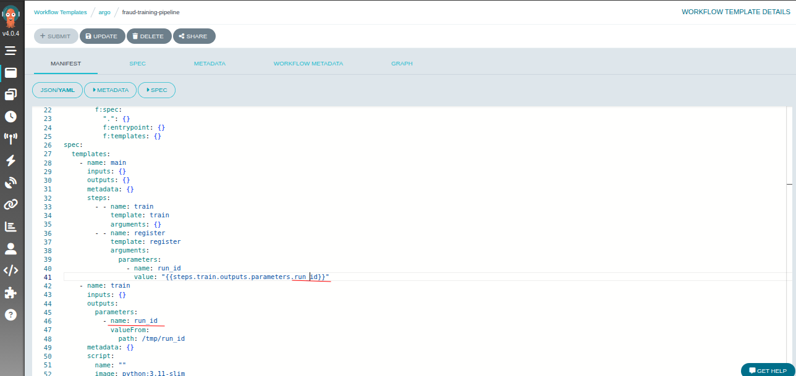
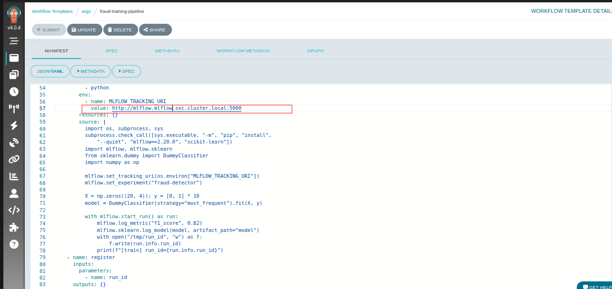
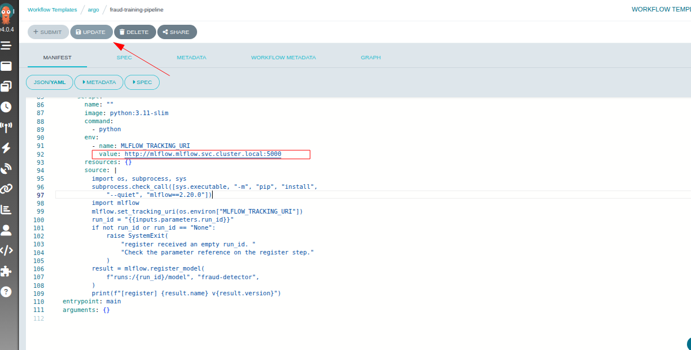
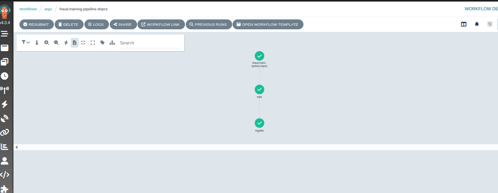
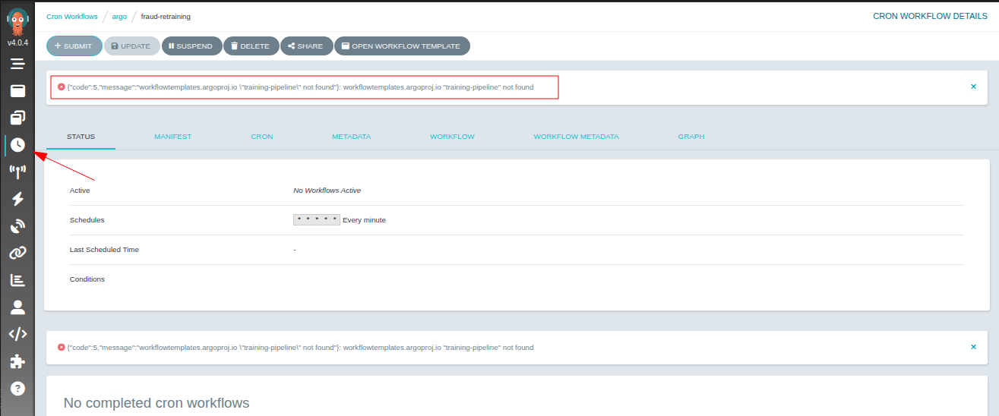
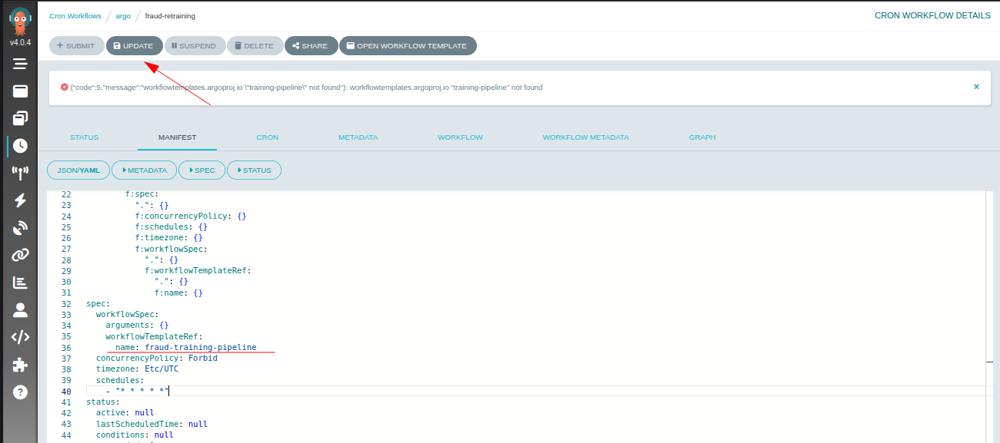
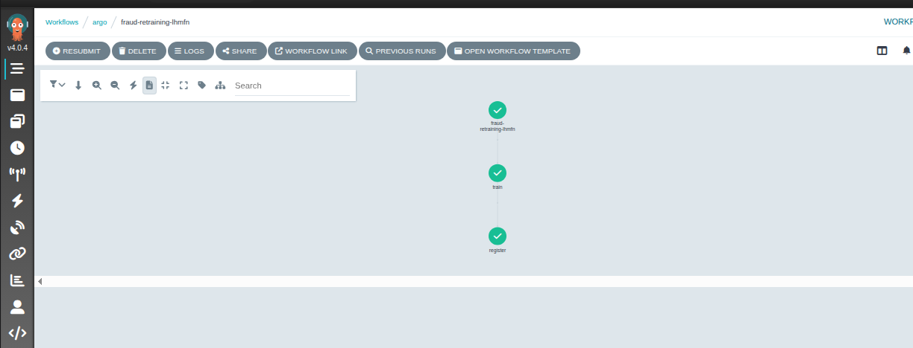
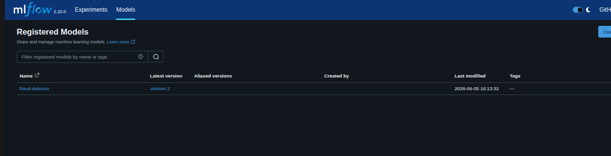
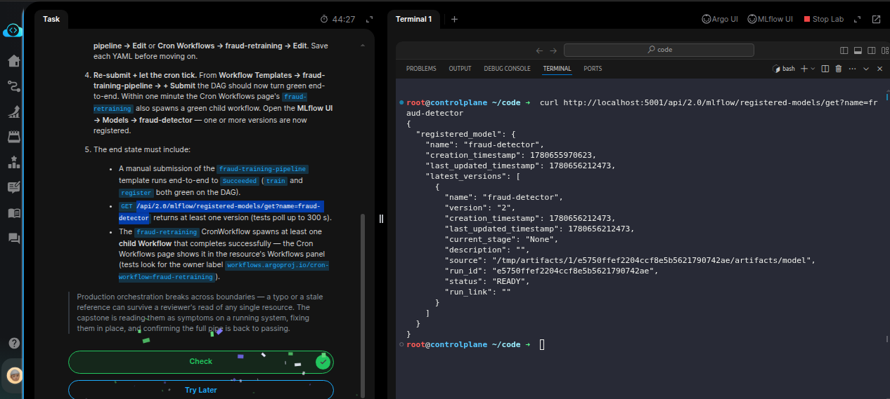

# Task: Production ML Pipeline: Argo Workflows + MLflow on Kubernetes

The xFusionCorp Industries ML platform team is cutting the first production release of the `fraud-detector` pipeline. A `WorkflowTemplate` named `fraud-training-pipeline` trains a model and registers it in *MLflow*; a `CronWorkflow` named `fraud-retraining` re-runs the template every minute. Argo and an in-cluster MLflow are running, but the release is broken on three fronts. Your capstone task is to fix all three bugs entirely through the Argo UI — no kubectl, no file edits — and confirm that a new version of fraud-detector appears on the MLflow Models page.


1. Open the four surfaces:

  - Argo UI (port `5000`) – Workflows list, Workflow Templates, Cron Workflows.
  - MLflow UI (port `5001`) – Models page is empty; no version of `fraud-detector` has been registered yet.

2. Surface the failures. Submit `fraud-training-pipeline` once from Workflow Templates → `fraud-training-pipeline` → + Submit (no form parameters needed). The run fails — open the failing node's Logs drawer to see why. Then open the Cron Workflows page and inspect what fraud-retraining is doing (or failing to do) over the last few minutes. Three independent wiring issues sit between the run logs, the WorkflowTemplate spec, and the CronWorkflow spec.

3. Fix all three, all via the Argo UI's YAML editors. Each fix is a single value change in either Workflow Templates → fraud-training-pipeline → Edit or Cron Workflows → fraud-retraining → Edit. Save each YAML before moving on.

4. Re-submit + let the cron tick. From Workflow Templates → fraud-training-pipeline → + Submit the DAG should now turn green end-to-end. Within one minute the Cron Workflows page's fraud-retraining also spawns a green child workflow. Open the MLflow UI → Models → fraud-detector — one or more versions are now registered.

  - The end state must include:

  - A manual submission of the `fraud-training-pipeline` template runs end-to-end to Succeeded (train and register both green on the DAG).
  - `GET /api/2.0/mlflow/registered-models/get?name=fraud-detector` returns at least one version (tests poll up to 300 s).
  - The `fraud-retraining` *CronWorkflow* spawns at least one child Workflow that completes successfully — the Cron Workflows page shows it in the resource's Workflows panel (tests look for the owner label `workflows.argoproj.io/cron-workflow=fraud-retraining`).

> Production orchestration breaks across boundaries — a typo or a stale reference can survive a reviewer's read of any single resource. The capstone is reading them as symptoms on a running system, fixing them in place, and confirming the full pipe is back to passing.


---
 # Solution:

- This tasks is to fix a broken workflow pipeline and MLFlow model registry on Argo UI ( no code changes, and use of kubectl). 

- The discription says to run the Workflow once to surface the issues. Open the Argo UI and submit the `fraud-training-pipeline` Workflow. We can see
  the logs print:

```
 {"code":3,"message":"templates.main.steps failed to resolve {{steps.train.outputs.parameters.runid}}"}: templates.main.steps failed to resolve {{steps.train.outputs.parameters.runid}}
```



There's some issue with passing the parameters in `train` step. The parameters name referred in the `spec.template.steps` for `run_id` is wronly
defined as `runid`, where as the `output.parameters` names is `run_id` we fix that.




But the task gave us a hint saying *Three independent wiring issues sit between the run logs, the WorkflowTemplate spec, and the CronWorkflow spec*.
When we try to run the workflow again, we see that the mlflow endpoint is not resolving, and its defined as `mlflow.default.svc.cluster.local:5000`.
But, when we inspect the cluster on the lab terminal, we can see that there is not Service named `mlflow` in `default` namespace and the mlfow Serbice
is infact available in the `mlflow` namespace. So, the correct endpoint for mlflow needs to be `mlflow.mlflow.svc.cluster.local:5000`. We update the
endpoint on line *57* and *92* where it's wrong.





- Now when we resubit the workflow template, we get success for both `train` and `register` nodes.



- Now, we need to attend the CronWorklflow. Navigate to CronWorkflow page, and submit the `fraud-retraining` cronWorkflow. We immediatly see an error
  saying *training-pipeline not found*.




- Inspect the CromWorkflow manifest, and we coud indentify that the Cron references wrong WorkflowTemplate. It should read `fraud-training-pipeline`
instead of `training-pipeline` (That's the name of the WorkflowTemplate that we just fixed). Update the template nameand submit.



- Now we can see that the CronTemplate also succeeds with the two nodes `train` and `register`.



- Also verify that the `fraud-detector` model is registered and showing on the MLFlow registry page




- On the lab terminal, curl the registries `/registered-models` endpoint and we get the details of the `fraud-detector` model.




Done!! Hit **Check**
