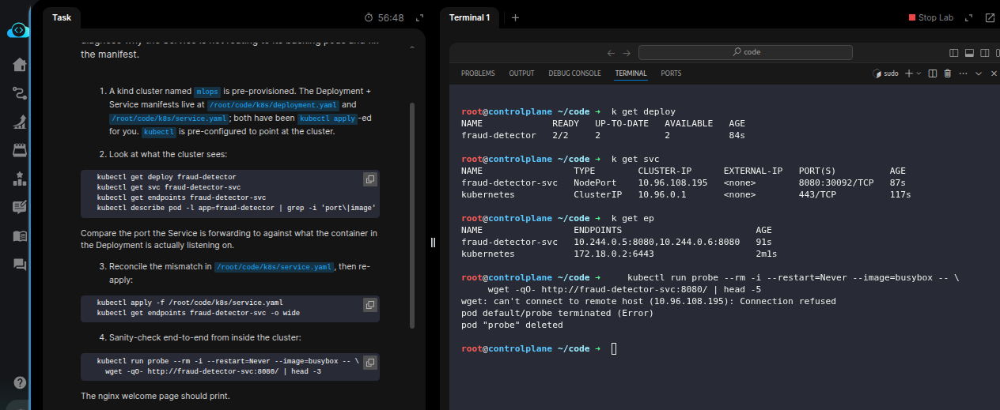
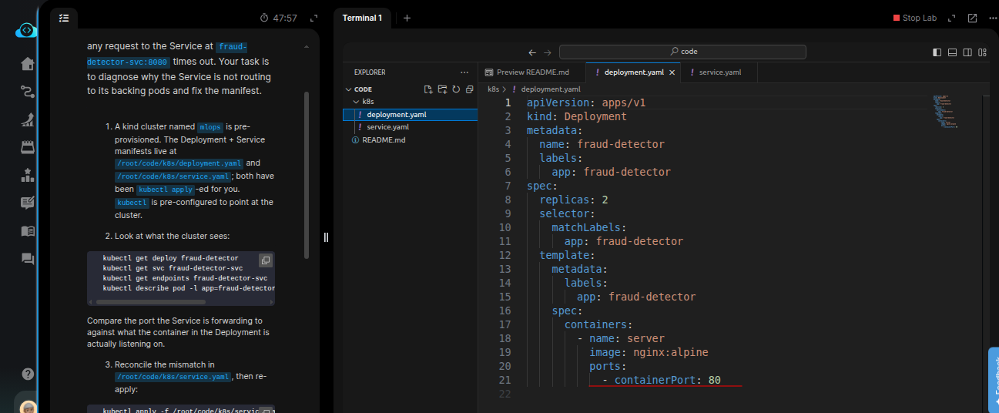
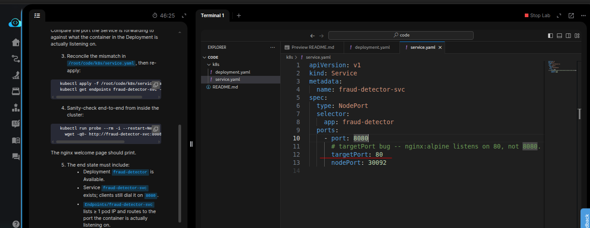
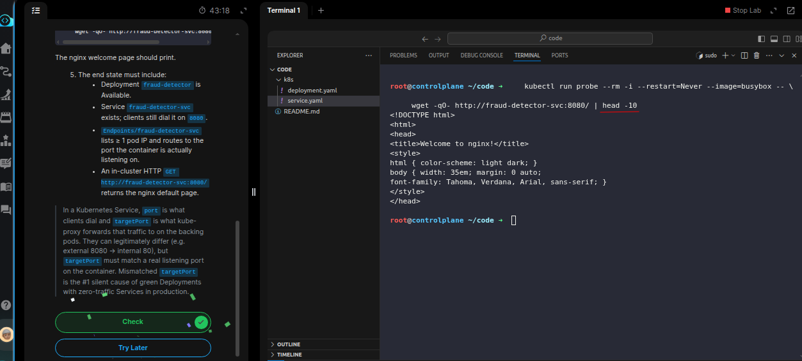

# Task: Deploy an ML Model on Kubernetes

The xFusionCorp Industries ML platform team shipped the first Kubernetes deployment of the `fraud-detector` model server. The Deployment is running two replicas cleanly — `kubectl get deploy fraud-detector` shows **READY 2/2** — but any request to the Service at `fraud-detector-svc:8080` times out. Your task is to diagnose why the Service is not routing to its backing pods and fix the manifest.

1. A kind cluster named `mlops` is pre-provisioned. The Deployment + Service manifests live at `/root/code/k8s/deployment.yaml` and `/root/code/k8s/service.yaml`; both have been kubectl apply-ed for you. `kubectl` is pre-configured to point at the cluster.

2. Look at what the cluster sees:

```
   kubectl get deploy fraud-detector
   kubectl get svc fraud-detector-svc
   kubectl get endpoints fraud-detector-svc
   kubectl describe pod -l app=fraud-detector | grep -i 'port\|image'
```

Compare the port the Service is forwarding to against what the container in the Deployment is actually listening on.

3. Reconcile the mismatch in `/root/code/k8s/service.yaml,` then re-apply:

```
   kubectl apply -f /root/code/k8s/service.yaml
   kubectl get endpoints fraud-detector-svc -o wide
```

4. Sanity-check end-to-end from inside the cluster:

```
   kubectl run probe --rm -i --restart=Never --image=busybox -- \
     wget -qO- http://fraud-detector-svc:8080/ | head -3
```

The nginx welcome page should print.

5. The end state must include:
  - Deployment `fraud-detector` is Available.
  - Service `fraud-detector-svc` exists; clients still dial it on `8080`.
  - `Endpoints/fraud-detector-svc` lists ≥ 1 pod IP and routes to the port the container is actually listening on.
  - An in-cluster HTTP `GET http://fraud-detector-svc:8080/` returns the nginx default page.

> In a Kubernetes Service, port is what clients dial and targetPort is what kube-proxy forwards that traffic to on the backing pods. They can legitimately differ (e.g. external 8080 → internal 80), but targetPort must match a real listening port on the container. Mismatched targetPort is the #1 silent cause of green Deployments with zero-traffic Services in production.

--- 
# Solution:

- This involes as described in the task, fixing the connectivity between the Service and Pods owned by the `fraud-detector` Deployment. 

- Inspect the Deployments, Service, and EndpointSlice resorces in the clusters related to `fraud-detector` Deployment.
The Deployment, Service, and EndpointSlice looks good, but the `fraud-detector` pods are not reachable from within the cluster, and we need to fix
this connectivity.



- Inspect the Deployment and Service manifests in VSCode. We can see that the containerPOrt exposed by the Deployment is `80`, but the Service's
`targetPort` is set to `8080`. And there's comment to help us saying *Nginx listens at port 80*.



- Update the Service `targetPort` correctly to `80`, and re-apply the manifest.



- Now, delete the `probe` Pod created earlier, and use the command provided in the **Sanity check** step. Or `exec` into the existing `probe` Pod and try curling the `fraud-detector-svc:8080`, and we should see the default Nginx page.



Done!! Hit **Check**
