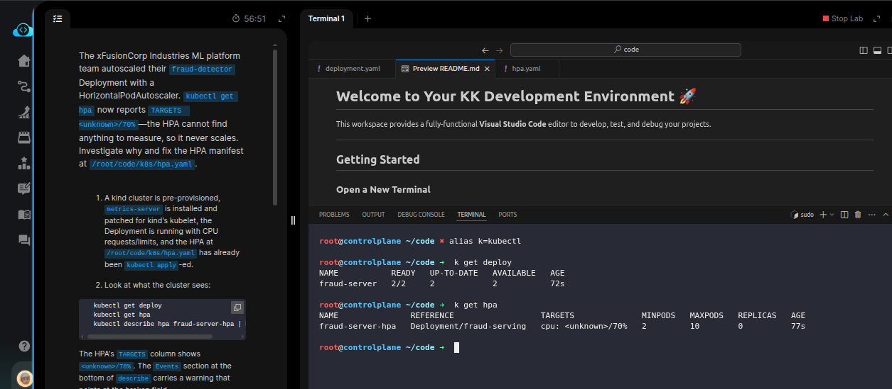
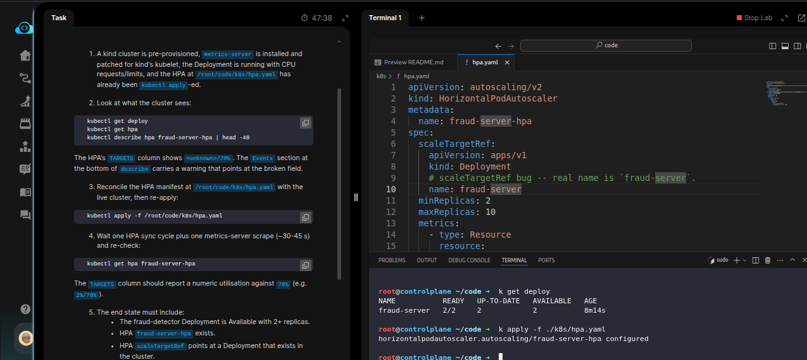
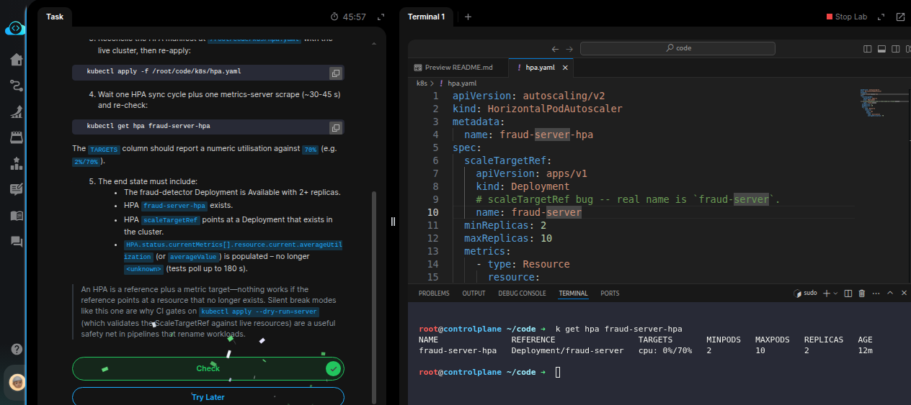

# Task: Configure HPA for ML Serving Deployment

The xFusionCorp Industries ML platform team autoscaled their `fraud-detector` Deployment with a *HorizontalPodAutoscaler*. `kubectl get hpa` now reports `TARGETS  <unknown>/70%` — the HPA cannot find anything to measure, so it never scales. Investigate why and fix the HPA manifest at `/root/code/k8s/hpa.yaml`.


1. A kind cluster is pre-provisioned, metrics-server is installed and patched for kind's kubelet, the Deployment is running with CPU requests/limits, and the HPA at `/root/code/k8s/hpa.yaml` has already been kubectl apply-ed.

2. Look at what the cluster sees:

```
   kubectl get deploy
   kubectl get hpa
   kubectl describe hpa fraud-server-hpa | head -40
```


The HPA's `TARGETS` column shows `<unknown>/70%`. The Events section at the bottom of describe carries a warning that points at the broken field.

3. Reconcile the HPA manifest at `/root/code/k8s/hpa.yaml` with the live cluster, then re-apply:
   `kubectl apply -f /root/code/k8s/hpa.yaml`

4. Wait one HPA sync cycle plus one metrics-server scrape (~30-45 s) and re-check:
   `kubectl get hpa fraud-server-hpa`

The `TARGETS` column should report a numeric utilisation against 70% (e.g. 2%/70%).

5. The end state must include:
  - The `fraud-detector` Deployment is Available with 2+ replicas.
  - HPA `fraud-server-hpa` exists.
  - HPA `scaleTargetRef` points at a Deployment that exists in the cluster.
  - `HPA.status.currentMetrics[].resource.current.averageUtilization` (or averageValue) is populated – no longer <unknown> (tests poll up to 180 s).

> An HPA is a reference plus a metric target—nothing works if the reference points at a resource that no longer exists. Silent break modes like this one are why CI gates on kubectl apply --dry-run=server (which validates the ScaleTargetRef against live resources) are a useful safety net in pipelines that rename workloads.

---

# Solution:

- This task is about fixing the HorizontalPOdAutoscaler (HPA) on the cluster and configure it to scale the Deployment Pods based on the ``

- Inspect the current state of Deployment and HPA on the cluster:



The HPA `TARGETS` is showing `<unknown`. 

- Inspect the `hpa.yaml` manifest to see curently how its configured. We can already see the hint in the manifest, andf verify the name of the
Deployment is not matching the `spec.scaledTargetRef` in HPS. `scaledTargetRef` should target the deployment we want to scale based on the metrics.

Update it to target correct Deployment and re-apply.




- Check if HPA is now reporting current ustilization and not showing `UNKNOWN`. As there is no activity during my instance of this lab, the current
utilization is showing `0%` it may vary in your case.



Done!! Hit **Check**

