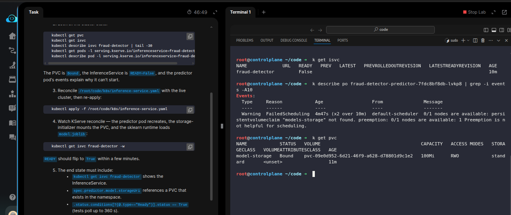
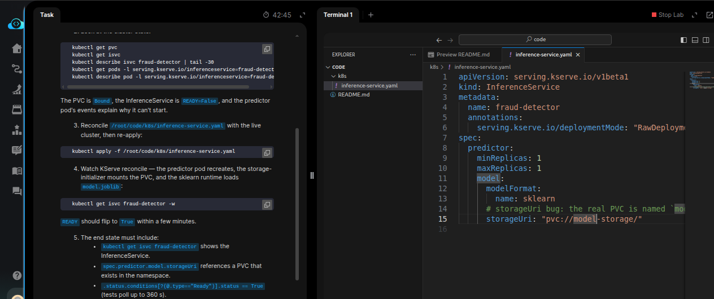
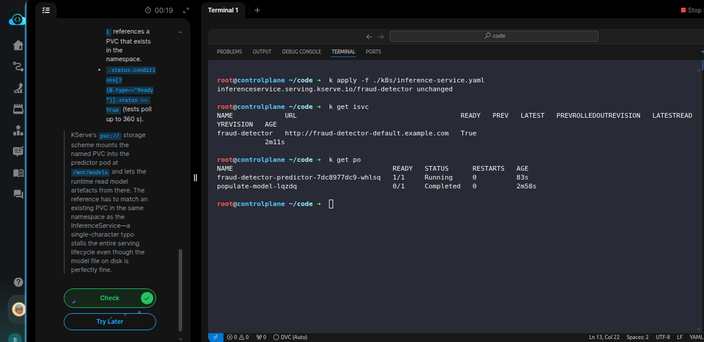

# Task: Deploy a Model with KServe InferenceService

The xFusionCorp Industries ML platform team set up *KServe* on their kind cluster and staged a `fraud-detector` `InferenceService` backed by a PVC-mounted sklearn model. The InferenceService never reaches Ready — the `predictor` pod hangs in *Pending*. Investigate why and fix the manifest at `/root/code/k8s/inference-service.yaml` so the InferenceService flips to Ready.


1. A kind cluster is running, `cert-manager` + `KServe` v0.14.1 are installed, a 100 Mi `PVC` named `model-storage` has been populated with a `DummyClassifier` `model.joblib` (a one-shot Job), and a broken `InferenceService` manifest is applied at `/root/code/k8s/inference-service.yaml.` KServe runs in *RawDeployment* mode (annotation on the InferenceService) to skip Istio + Knative.

2. Look at the cluster state:

```
   kubectl get pvc
   kubectl get isvc
   kubectl describe isvc fraud-detector | tail -30
   kubectl get pods -l serving.kserve.io/inferenceservice=fraud-detector
   kubectl describe pod -l serving.kserve.io/inferenceservice=fraud-detector
```


The PVC is Bound, the InferenceService is READY=False, and the `predictor` pod's events explain why it can't start.

3. Reconcile `/root/code/k8s/inference-service.yaml` with the live cluster, then re-apply:
   `kubectl apply -f /root/code/k8s/inference-service.yaml`

4. Watch KServe reconcile — the `predictor` pod recreates, the `storage-initializer` mounts the PVC, and the sklearn runtime loads `model.joblib`:
   `kubectl get isvc fraud-detector -w`

`READY` should flip to `True` within a few minutes.

5. The end state must include:
  - `kubectl get isvc fraud-detector` shows the InferenceService.
  - `spec.predictor.model.storageUri` references a PVC that exists in the namespace.
  - `.status.conditions[?(@.type=="Ready")].status == True` (tests poll up to 360 s).


> KServe's pvc:// storage scheme mounts the named PVC into the predictor pod at /mnt/models and lets the runtime read model artefacts from there. The reference has to match an existing PVC in the same namespace as the InferenceService—a single-character typo stalls the entire serving lifecycle even though the model file on disk is perfectly fine.

---

# Solution:

- This task is to fix the `InferenceService` [**kserve](https://kserve.github.io/website/docs/model-serving/generative-inference/llmisvc/llmisvc-overview) CRD.

- First inspect the current state of the InferenceService on the cluster. We can see by describing thge Pod owned by InferenceService it fails due to
  *persistentvolumeclaim "models-storage" not found*. When we check for the PVC on the cluster it's available and named `model-storage` (singular).



- Update the `inference-service.yaml` manifest for InferenceService resource with the correct PVC name in `spec.model.storageUri`.



- After re-applying the `inference-service.yaml` after couple of seconds when we query for InferenceService resource, we see that it is transitions to
`READY=True` and the inference-service pods are in `Running` condition.



Done!! Hit **Check**
