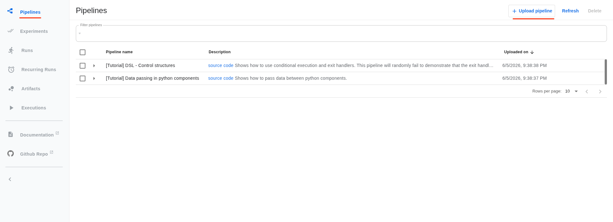
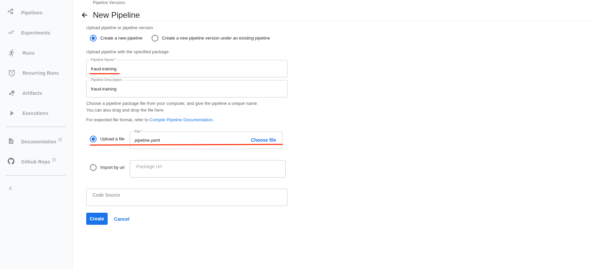
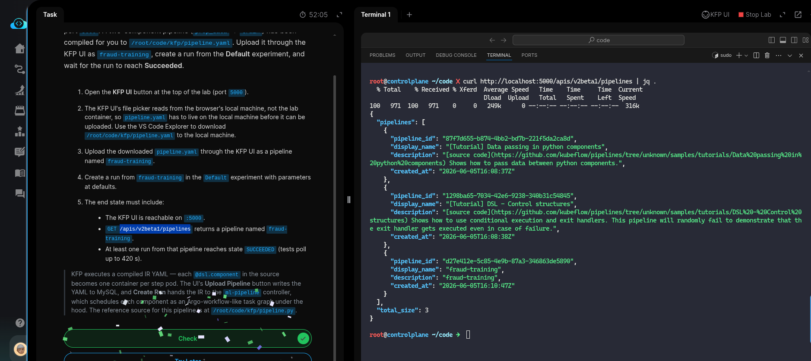

# Task: Kubeflow Pipelines - Install and Run a Basic KFP Pipeline

The xFusionCorp Industries ML platform team is piloting **Kubeflow Pipelines** on their kind cluster. KFP v2.4 is pre-installed (`ml-pipeline`, `ml-pipeline-ui`, `minio`, `mysql`, `metadata` services—all Available) and the UI is exposed on port `5000`. A two-component pipeline (`prep_data` → train) has been compiled for you to `/root/code/kfp/pipeline.yaml`. Upload it through the KFP UI as `fraud-training`, create a run from the Default experiment, and wait for the run to reach Succeeded.

1. Open the KFP UI button at the top of the lab (port `5000`).

2. The KFP UI's file picker reads from the browser's local machine, not the lab container, so `pipeline.yaml` has to live on the local machine before it can be uploaded. Use the VS Code Explorer to download `/root/code/kfp/pipeline.yaml` to the local machine.

3. Upload the downloaded `pipeline.yaml` through the KFP UI as a pipeline named `fraud-training`.

4. Create a `run` from `fraud-training` in the Default experiment with parameters at defaults.

5. The end state must include:

  - The KFP UI is reachable on `:5000`.
  - `GET /apis/v2beta1/pipelines` returns a pipeline named `fraud-training`.
  - At least one run from that pipeline reaches state `SUCCEEDED` (tests poll up to 420 s).

> KFP executes a compiled IR YAML — each @dsl.component in the source becomes one container per step pod. The UI's Upload Pipeline button writes the YAML to MySQL, and Create Run hands the IR to the ml-pipeline controller, which schedules each component as an Argo-workflow-like task graph under the hood. The reference source for this pipeline is at /root/code/kfp/pipeline.py.

---

- This task deals with uploading the pipeline.yaml to [KubeFlow](https://www.kubeflow.org/docs/) UI, and creating a runa default expirement with from that pipeline.

> Note: As descibed in the description, to upload the `pipeline.yaml` to KubeFlow UI, we need the pipeline manifest on our host (not the lab
> terminal). We can either download from the VSCode explorer or copy the contentx of YAML from `./kfp/pipeline.yaml` to our host.

- Open Kubeflow UI, and upload the `pipeline.yaml` from your host and create Pipeline named `fraud-training`.

- Once the file is uploaded and pipeline created. Create a new run to run an expirement, and wait for it to complete.

- On the lab terminal query the `/pipelines` endpoint using `curl` and this should return you the `fraud-training` pipeline run as JSON reponse.

Done!! Hit **Check**.
