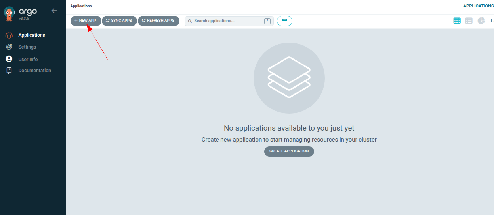
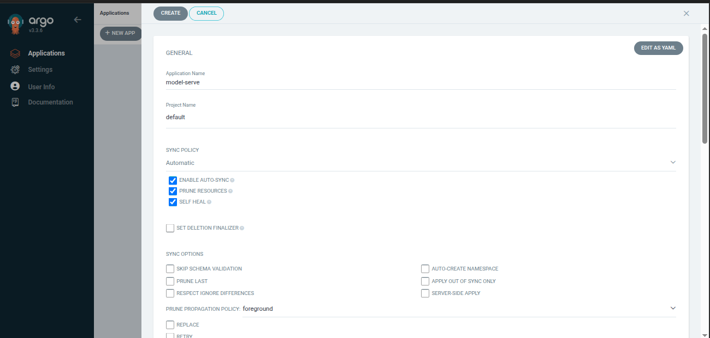
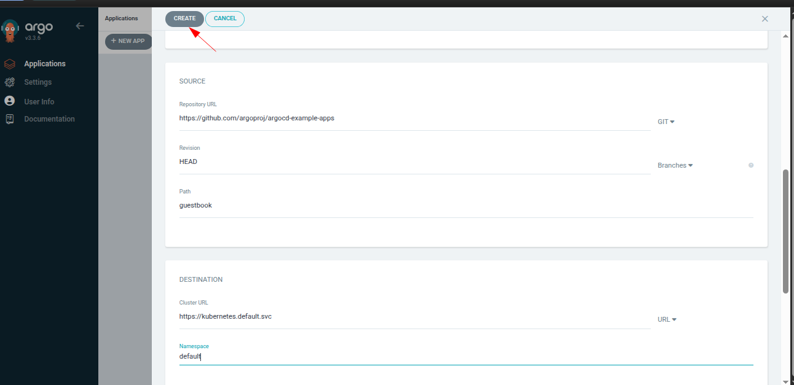
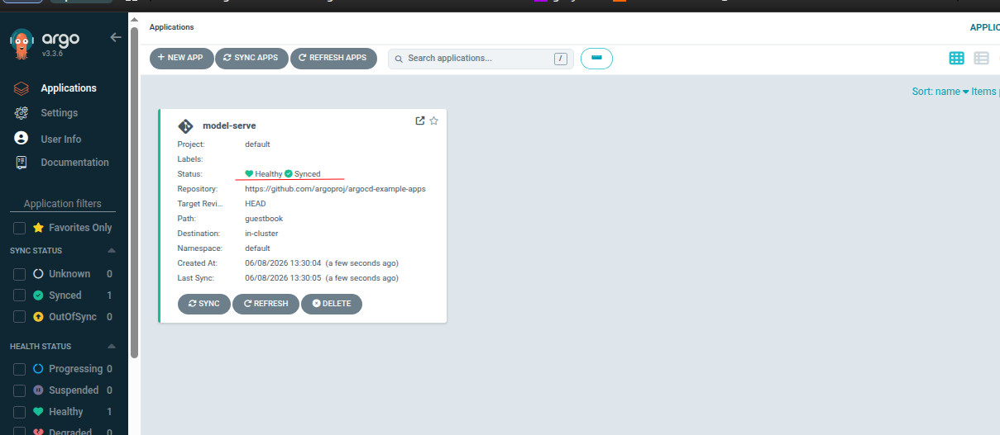
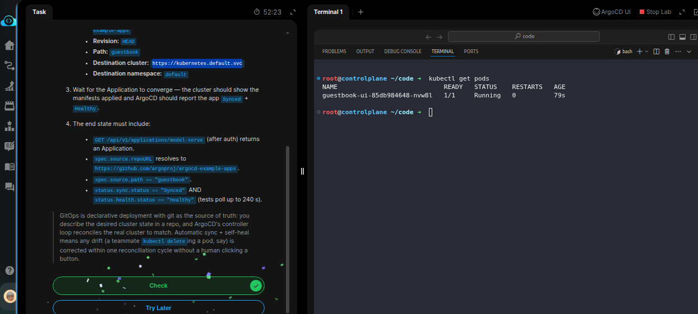

# Task: GitOps Model Deployment with ArgoCD

The xFusionCorp Industries ML platform team is adopting GitOps for their Kubernetes workloads: every deployable resource lives in a git repo, and ArgoCD keeps the cluster reconciled against that repo. ArgoCD v3.3.6 is already running on the `mlops` kind cluster and the UI is reachable on port `5000`. Your task is to use the UI to create an *Application* pointing at the canonical `argoproj/argocd-example-apps` guestbook path, sync it, and confirm that the cluster matches the repo.

1. Open the ArgoCD UI button at the top of the lab (port `5000`). The admin password is `admin` (username `admin`).

2. Create an Application from the UI with these values:

  - Name: `model-serve`
  - Project: `default`
  - Sync Policy: `Automatic`, with prune and self-heal enabled
  - Repository URL: `https://github.com/argoproj/argocd-example-apps`
  - Revision: `HEAD`
  - Path: `guestbook`
  - Destination cluster: `https://kubernetes.default.svc`
  - Destination namespace: `default`

3. Wait for the Application to converge — the cluster should show the manifests applied and ArgoCD should report the app Synced + Healthy.

4. The end state must include:

  - GET `/api/v1/applications/model-serve` (after auth) returns an Application.
  - `spec.source.repoURL` resolves to https://github.com/argoproj/argocd-example-apps.
  - `spec.source.path` == "guestbook".
  - `status.sync.status == "Synced"` AND `status.health.status == "Healthy"` (tests poll up to 240 s).

> GitOps is declarative deployment with git as the source of truth: you describe the desired cluster state in a repo, and ArgoCD's controller loop reconciles the real cluster to match. Automatic sync + self-heal means any drift (a teammate kubectl deleteing a pod, say) is corrected within one reconciliation cycle without a human clicking a button.

---

# Solution:

- This task deals with creating an ArgoCD Application, which is a custom resource that tells ArgoCD which Git repository and directory contain the desired Kubernetes manifests, where those manifests should be deployed, and how synchronization should be performed. In this case, we need to create an Application named `model-serve` that points to the `guestbook` directory of the `argoproj/argocd-example-apps` repository and configure it for automatic synchronization, pruning, and self-healing.

- Navigate to the Argo UI, and login with the credentials provided (`admin`/`admin`). Create a **NEW APP** from the **Applications** menu.

- Fill the Application form with the details provided in the task description, and create a new Argo Application:

- Wait for the Application to transition to `Healthy` and `Synced` 

- Now the `guestbook` Deployment and pods should be available on the local cluster and be in Running state.

Done!! Hit **Check**.
