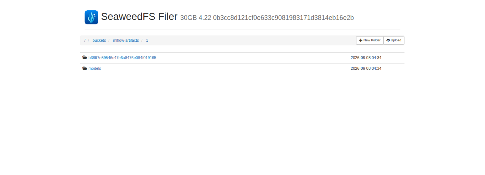
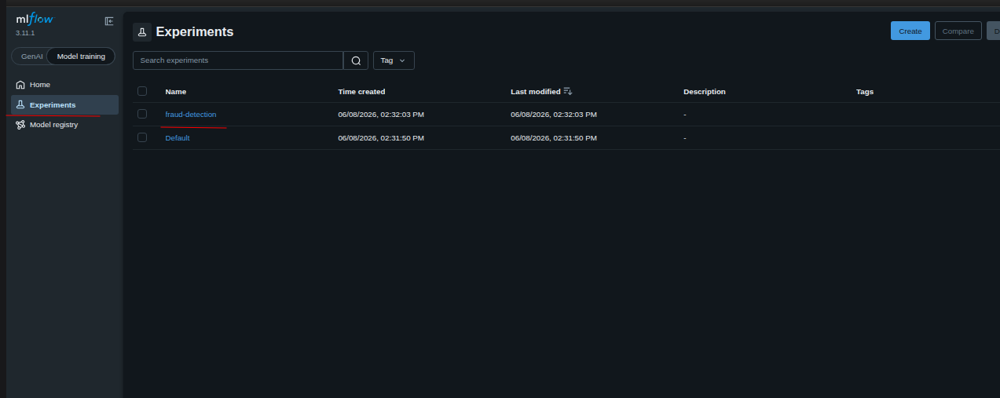
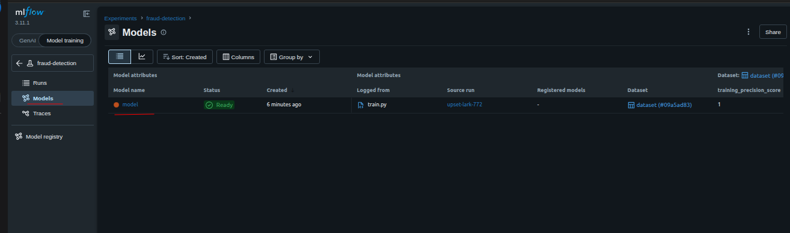
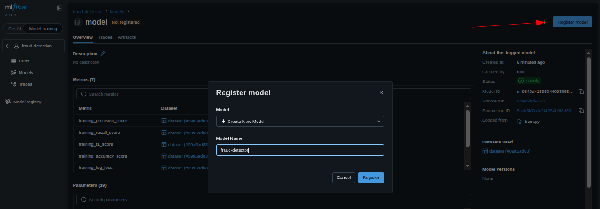
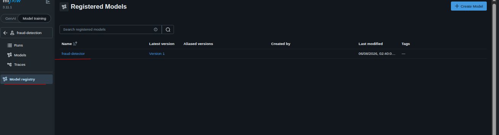
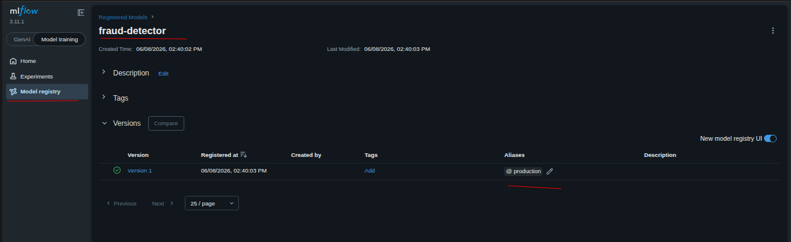
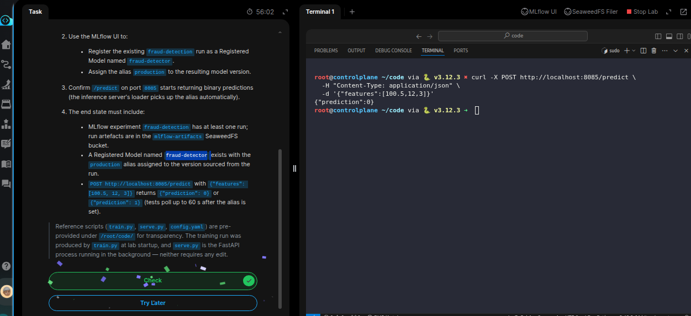

# Task: Capstone (1/4): End-to-End ML System - Train, Register, Serve

The xFusionCorp Industries MLOps team is wiring a `fraud-detection` model from a training run all the way to a live FastAPI endpoint. The backing stack is already running: SeaweedFS object store, an MLflow tracking server, a seeded training dataset, a completed training run on the `fraud-detection` experiment, and a FastAPI inference server on `:8085` waiting for the model to become available. Promote the run to a registered model and assign it an alias so the inference server can serve predictions.

1. Open the MLflow UI and SeaweedFS Filer buttons at the top of the lab. The pre-staged state:

  - SeaweedFS bucket data holds `transactions.csv`; `mlflow-artifacts` holds the artefacts of one completed training run. Both are visible in the Filer UI under `/buckets/`.
  - `MLflow` experiment `fraud-detection` lists that one run.
  - The Model Registry is empty.
  - The FastAPI server on `:8085` is running; `/predict` returns `503` because no registered model with the expected alias exists yet.

2. Use the MLflow UI to:

  - Register the existing `fraud-detection` run as a Registered Model named `fraud-detector`.
  - Assign the alias `production` to the resulting model version.
  - Confirm `/predict` on port `8085` starts returning binary predictions (the inference server's loader picks up the alias automatically).

3. The end state must include:

  - `MLflow` experiment `fraud-detection` has at least one run; run artefacts are in the `mlflow-artifacts` SeaweedFS bucket.
  - A Registered Model named `fraud-detector` exists with the `production` alias assigned to the version sourced from the run.
  - `POST http://localhost:8085/predict` with `{"features": [100.5, 12, 3]}` returns `{"prediction": 0}` or `{"prediction": 1}` (tests poll up to 60 s after the alias is set).

> Reference scripts (train.py, serve.py, config.yaml) are pre-provided under /root/code/ for transparency. The training run was produced by train.py at lab startup, and serve.py is the FastAPI process running in the background — neither requires any edit.

---

# Solution:

- This capstone task requires to register the model with model registry and assign an alias `production` to the versioned model. Then test the
`/predict` endpoint and confirm if it returns binary classification `0` or `1`.

- Inspect the Seaweed UI and confirm, if a complete run of the experiment is listed in the `mldlow-artifacts` is available.

- After confirming the artrifacts on SeaweedFS UI, navigate to MLFlow UI and check the experiment named `fraud-detection` has one run

- Register this as a model in the model registry

- Uncer the newly registered model `fraud-detector` add an alias `production` to it

- After adding the alias, from the lab terminal we need to query the `/predict` endpoint and ensure it returs a classification as asked.

Done!! we've registered the model, assigned it an alias `production`, and the inference server is serving predictions.

Hit **Check**

