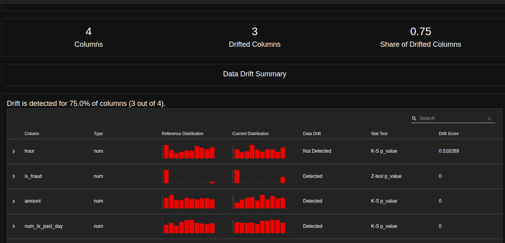
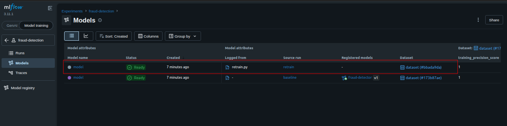
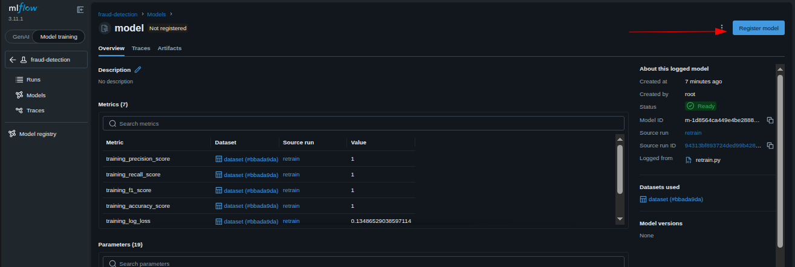
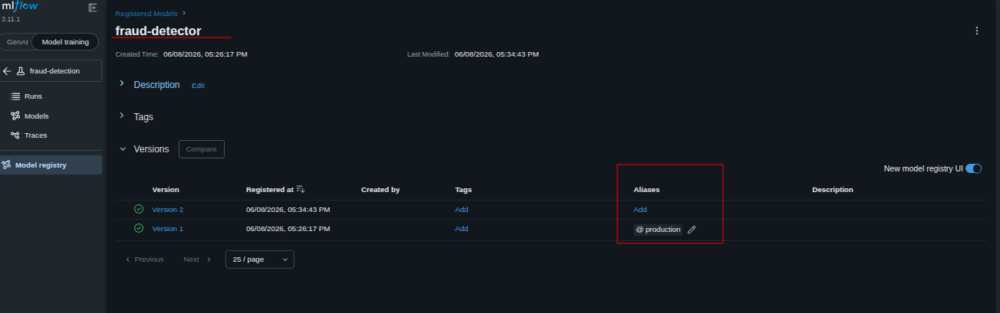
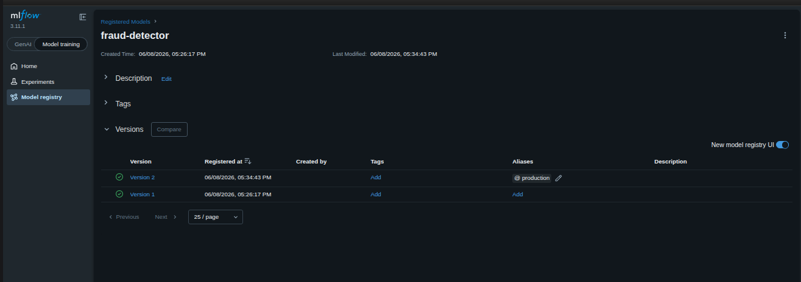

# Task: Capstone (2/4): Monitoring and Automated Retraining

The xFusionCorp Industries MLOps team is operating a `fraud-detector` in production. The live transaction stream has shifted away from the distribution the deployed model was trained on, and the retraining protocol has already produced a new MLflow run on the combined data. A drift report quantifying the shift is also pre-published. Your task is to inspect the drift signal in the browser, register the new run as a new version of `fraud-detector`, and move the production alias to that version.

1. The pre-staged state:

  - An MLflow tracking server is on :5000 (SQLite metadata, SeaweedFS artefacts at :8333 / Filer :8888).
  - Registered model fraud-detector exists at version 1 with the production alias, trained on /root/code/data/reference.csv.
  - The fraud-detection experiment also contains a retrain run produced from the union of reference.csv + current.csv. This run is not yet registered.
  - A static-file server on port 8086 serves /root/code/reports/. drift.html and drift-summary.json have already been generated against the two CSVs.

2. Open the Drift Report button at the top of the lab and review the Evidently report. Dataset drift is flagged; the column-level breakdown shows which features have shifted.

3. From the MLflow UI Models tab:

  - Register the existing retrain run as a new version of fraud-detector (this becomes version 2).
  - Move the alias production from version 1 to version 2.

4. The end state must include:

  - /root/code/reports/drift.html exists; the Evidently summary records dataset_drift=True.
  - The fraud-detection experiment contains a run named retrain.
  - The registered model fraud-detector has at least version 2, sourced from the retrain run.
  - The production alias on fraud-detector points at version 2 (or higher) — no longer at version 1.

> Reference scripts /root/code/drift.py and /root/code/retrain.py are pre-provided for transparency; both have already been executed at lab startup, so neither needs to be re-run.

---
# Solutions:

- This task focuses on a typical MLOps monitoring and retraining workflow. An Evidently drift report has already identified significant data drift between the reference dataset used to train the current production model and the latest production data. A retraining pipeline has already trained a new model using the combined `reference.csv` and `current.csv` datasets and logged the result as an MLflow run named `retrain`. Our objective is to review the drift report, register the retrained model as a new version of the existing `fraud-detector` registered model, and then move the `production` alias from version `1` to the newly registered version so that future predictions use the model trained on the updated data distribution.

- Inspect the drift report by clicking on the `drift.html` from **Drift report** UI, we can see that the `is_fraud`, `amount`, and `num_tx_past_day` data distributions have changed.

- Navigate to MLFlow UI, and under `expirements`, and `models` we can see there is another run triggered by `retrain.py`. We need to register this model in the
  registry and move the alias `production` from the older versiono f model to this new one.

- Register this new model generated from`retrain.py`

- We can see that the `Version 1` still has the `production` alias. We need to remove the alias, and add the `production` alias to `Version 2`.

- Done!! confirm the the `./reports/drift.html` exists, and hit **Check**

