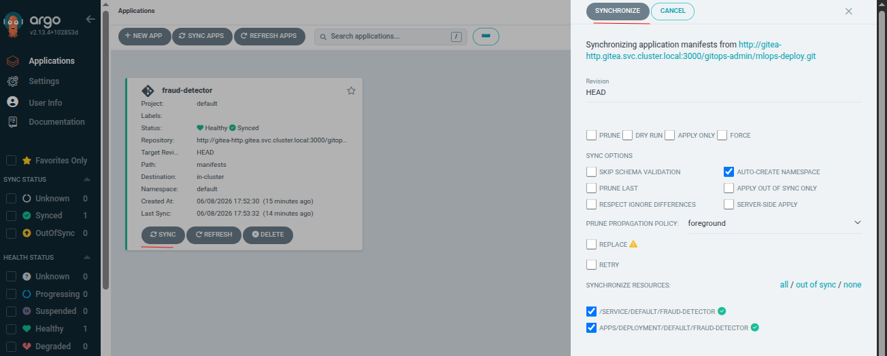
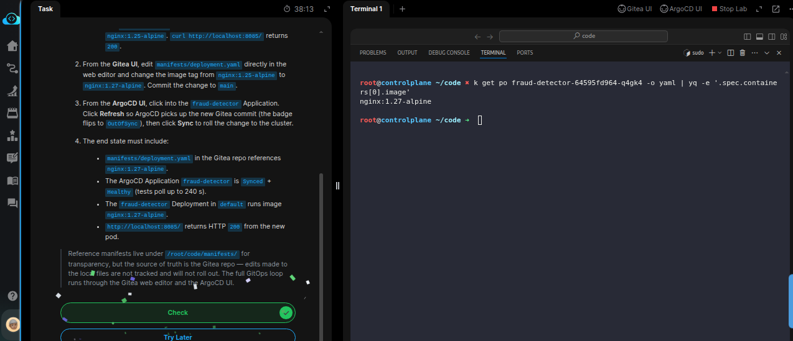

# Task: Capstone (3/4): Orchestrate the Full MLOps Loop with Argo Workflows

The xFusionCorp Industries MLOps team is closing the loop on continuous deployment for their `fraud-detector` model server. Cluster manifests live in a git repo, and an ArgoCD Application reconciles the cluster against that repo on demand. The kind cluster, in-cluster Gitea, ArgoCD, the seeded mlops-deploy repo, and a synced `fraud-detector` Deployment running `nginx:1.25-alpine` are all in place. Roll a new image version through the GitOps loop: bump the image tag in the Gitea repo, then refresh and sync the ArgoCD Application so the cluster picks up the change.

1. Open the Gitea UI (port `3000`) and the ArgoCD UI (port `5000`). Both accept ArgoCD `admin` / `adminadmin`, Gitea `gitops-admin` / `adminadmin.` The pre-staged state:

  - Gitea repo `gitops-admin/mlops-deploy` contains `manifests/deployment.yaml` (image `nginx:1.25-alpine`) and `manifests/service.yaml` (NodePort `30080`, exposed on host `:8085`).
  - ArgoCD Application `fraud-detector` reconciles `gitops-admin/mlops-deploy/manifests` to the cluster's default namespace and is currently Synced + Healthy.
  - The `fraud-detector` Deployment is running with image `nginx:1.25-alpine.` `curl http://localhost:8085/` returns 200.

2. From the Gitea UI, edit `manifests/deployment.yaml` directly in the web editor and change the image tag from `nginx:1.25-alpine` to `nginx:1.27-alpine.` Commit the change to main.

3. From the ArgoCD UI, click into the `fraud-detector` Application. Click Refresh so ArgoCD picks up the new Gitea commit (the badge flips to OutOfSync), then click Sync to roll the change to the cluster.

4. The end state must include:

  - `manifests/deployment.yaml` in the Gitea repo references `nginx:1.27-alpine`.
  - The ArgoCD Application `fraud-detector` is Synced + Healthy (tests poll up to 240 s).
  - The `fraud-detector` Deployment in default runs image `nginx:1.27-alpine`.
  - `http://localhost:8085/` returns HTTP 200 from the new pod.

> Reference manifests live under /root/code/manifests/ for transparency, but the source of truth is the Gitea repo — edits made to the local files are not tracked and will not roll out. The full GitOps loop runs through the Gitea web editor and the ArgoCD UI.
---
# Solution:

- This task deals with GitOps deployment workflow using Gitea and ArgoCD. The source of truth for the application manifests is the `gitops-admin/mlops-deploy` repository in Gitea, where the `fraud-detector` Deployment is currently configured to use the `nginx:1.25-alpine` image. The task is to update the Deployment manifest in the Git repository to use `nginx:1.27-alpine,` commit the change, and then use ArgoCD to detect and synchronize the updated desired state so that the running Deployment in the Kubernetes cluster is upgraded to the new image version while remaining in a Synced and Healthy state.

- Open the Gitea UI and login using provided credentials. Navigate to `maifests/deployment.yaml` in teh **mlops-deploy** repo, and update the
`containers.image` to `nginx:1.27-alpine` and commit the changes to the repo.

- Now, open the ArgoCD UI, login using the provided credentials and navigate to Applications, and click on the existing `fraud-detector` Application,
  and manually Syncronize the Application.

- Once the Application is syncronized, and Healthy. Return to the lab terminal and check if the new rollout of the Deployment is pushed, the Pods
are in dunning State, and the new Deployment is using the `nginx:1.27-alpine` image.

Done!! hit **Check**.

