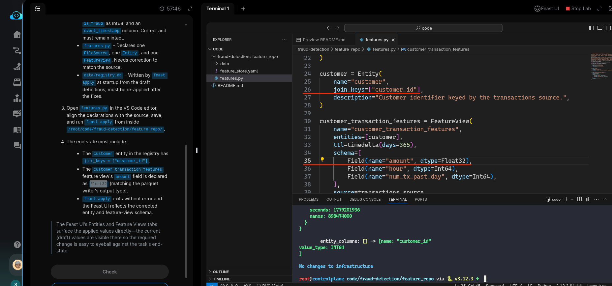
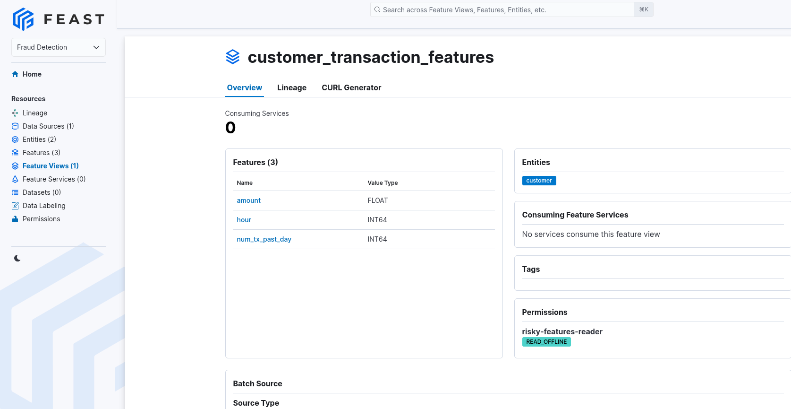

# Task: Define Feature Views in Feast

The xFusionCorp Industries ML platform team keeps the `fraud-detection` feature definitions in a Feast repository at `/root/code/fraud-detection/feature_repo/`. A draft `features.py` exists there, and the registry that feast apply wrote is inconsistent with the source data in `data/transactions.parquet`. Your task is to correct `features.py,` re-apply the registry, and confirm the corrected `customer_transaction_features` view in the Feast UI.

1. The Feast UI is already running on port `8888`. The **Feast UI** button at the top of the lab can be opened to confirm—the dashboard loads the `fraud_detection` project with one entity and one feature view carrying the draft declarations.

2. The repository layout under `/root/code/fraud-detection/feature_repo/`:

  - `feature_store.yaml` – The Feast config (project `fraud_detection`, local provider, sqlite online store, file offline store). Correct and must remain intact.
  - `data/transactions.parquet` – A 200-row synthetic source keyed by `customer_id`; carries amount as Float32, `hour` + `num_tx_past_day` + `is_fraud` as Int64, and an `event_timestamp` column. Correct and must remain intact.
  - `features.py` – Declares one `FileSource`, one `Entity`, and one `FeatureView`. Needs correction to match the source.
  - `data/registry.db` – Written by feast apply at startup from the draft definitions; must be re-applied after the fixes.

3. Open `features.py` in the VS Code editor, align the declarations with the source, save, and run feast apply from inside `/root/code/fraud-detection/feature_repo/`.

4. The end state must include:

  - The `customer` entity in the registry has `join_keys` = ["customer_id"].
  - The `customer_transaction_features` feature view's `amount` field is declared as `Float32` (matching the parquet writer's output type).
  - `feast apply` exits without error and the Feast UI reflects the corrected entity and feature-view schema.

> The Feast UI's Entities and Feature Views tabs surface the applied values directly—the current (draft) values are visible there so the required change is easy to eyeball against the task's end-state.

---

# Solution:

- The task is about fixing the `features.py` to match the desired end state:
  - The `customer` entity in the registry has `join_keys` = ["customer_id"].
  - The `customer_transaction_features` feature view's `amount` field is declared as `Float32`.
And finally:
  - `feast apply` exits without error and the Feast UI reflects the corrected entity and feature-view schema.

- We look at the `fraud-detection/feature_repo/features.py`. We can see that the `join_key` is misconfigured. It needs to be `customer_id` instead of
just `id`. The second is on line *26*. And the data type for `amount` field is set to String, instead it need to be `Float32` as desired.

After updating thesefields, we test this by running `feast apply` and could see that it returns with no errors.

- Additionally, we can start the Feast UI and see in the UI that the Feature view:

Hit **Check**

