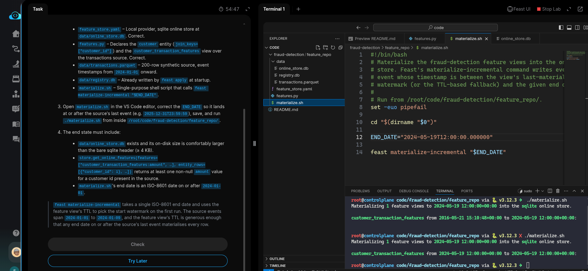

 # Task: Materialize Features to the Online Store

The xFusionCorp Industries ML platform team stages a materialisation script (`materialize.sh`) under `/root/code/fraud-detection/feature_repo/` so the batch job that populates the Feast online store is always repeatable. The registry has already been applied against a correct `features.py`, but running the script writes zero rows into the online sqlite store. Your task is to correct `materialize.sh` so `./materialize.sh` actually populates the online store, and confirm a non-null amount comes back from store.get_online_features() for a known customer.

1. The Feast UI is already running on port `8888`. The Feast UI button at the top of the lab can be opened to confirm—the dashboard loads the `fraud_detection` project, the `customer` entity, and the `customer_transaction_features` feature view. Materialisation status is not visible in the UI; the online store is inspected from the terminal.

2. The repository layout under `/root/code/fraud-detection/feature_repo/`:

  - `feature_store.yaml` – Local provider, sqlite online store at data/online_store.db. Correct.
  - `features.py` – Declares the customer entity (join_keys=["customer_id"]) and the customer_transaction_features view over the transactions source. Correct.
  - `data/transactions.parquet` – 200-row synthetic source, event timestamps from 2024-01-01 onward.
  - `data/registry.db` – Already written by feast apply at startup.
  - `materialize.sh` – Single-purpose shell script that calls feast materialize-incremental "$END_DATE".

3. Open `materialize.sh` in the VS Code editor, correct the `END_DATE` so it lands at or after the source's last event (e.g. `2025-12-31T23:59:59`), save, and run `./materialize.sh` from inside `/root/code/fraud-detection/feature_repo/`.

  - The end state must include:

  - `data/online_store.db` exists and its on-disk size is comfortably larger than the bare sqlite header (≥ 4 KB).
  - `store.get_online_features(features=["customer_transaction_features:amount",` …], entity_rows=[{"customer_id": i}, …]) returns at least one non-null amount value for a customer id present in the source.
  - `materialize.sh`'s end date is an ISO-8601 date on or after 2024-01-01.

> `feast materialize-incremental` takes a single ISO-8601 end date and uses the feature view's TTL to pick the start watermark on the first run. The source events span `2024-01-01` to `2024-01-09`, and the feature view's TTL is generous enough that any end date on or after the source's last event materialises every row.

---

# Solution:

- The task is to correct the errors with `END_DATE` in `./fraud-detection/feature_repo/materialize.sh` script. Open and inspect the script:

- Verify once by running `./materialize.sh`, and we see theat it runs without any errors.

Hit **Check**

